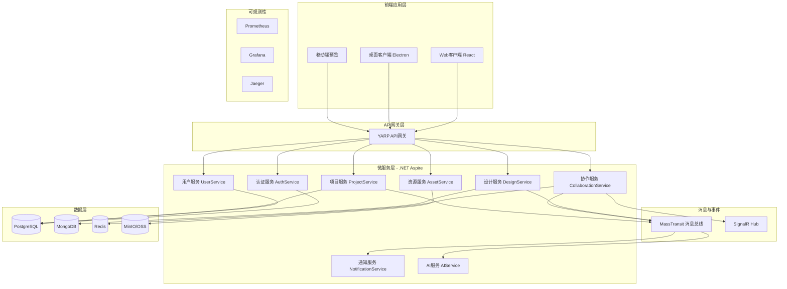
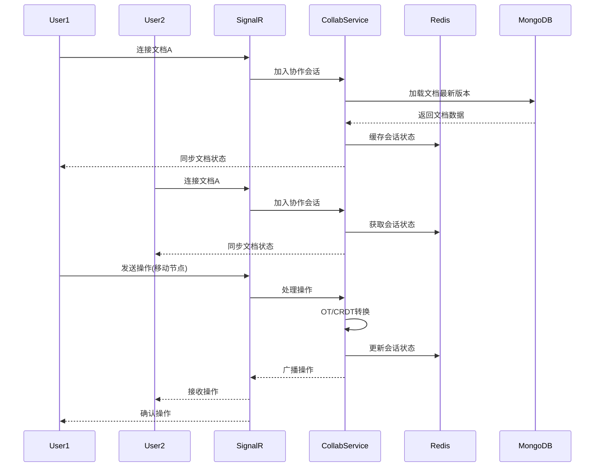

## 产品概述

ClawFlgma - 基于云原生的在线设计协作平台，对标Figma核心功能，支持矢量设计、实时协作、原型制作和开发者对接。

## 核心功能模块

- **设计引擎**: 矢量绘图、自动布局、组件系统、样式管理、Draw模式
- **协作中心**: 实时多人编辑、评论标注、版本管理、权限控制
- **原型系统**: 交互设计、动效演示、流程连线、智能动画
- **开发者工具**: Dev Mode、代码导出、切图标注、设计规范
- **AI增强**: 智能搜索、自动命名、设计推荐

## 交付物

生成完整的架构设计文档，包含：

- 微服务拆分方案
- .NET Aspire云原生架构设计
- 技术选型与实现方案
- 服务通信与数据流设计
- 部署与运维方案

## 技术栈选型

### 后端技术栈 (.NET 10 云原生)

- **框架**: .NET 10 + ASP.NET Core
- **云原生编排**: .NET Aspire (服务发现、配置管理、健康检查)
- **微服务通信**: 
- gRPC (服务间高性能通信)
- SignalR (实时协作推送)
- MassTransit + RabbitMQ/Kafka (异步消息队列)
- **数据存储**:
- PostgreSQL (主数据库，复杂查询)
- MongoDB (设计文件JSON文档存储)
- Redis (缓存、会话、分布式锁)
- MinIO/阿里云OSS (文件对象存储)
- **容器化**: Docker + Kubernetes
- **可观测性**: OpenTelemetry + Prometheus + Grafana + Jaeger

### 前端技术栈

- **框架**: React 18 + TypeScript
- **画布引擎**: Canvas API + SVG 混合渲染
- **状态管理**: Zustand (轻量级状态管理)
- **实时协作**: SignalR Client + Y.js (CRDT冲突解决)
- **UI组件**: Tailwind CSS + Radix UI

## 架构设计

### 整体架构图



### 微服务拆分方案

| 服务名称 | 职责 | 数据库 | 通信方式 |
| --- | --- | --- | --- |
| AuthService | 身份认证、OAuth、JWT令牌 | PostgreSQL | REST/gRPC |
| UserService | 用户管理、团队、权限 | PostgreSQL | REST/gRPC |
| ProjectService | 项目管理、文件组织、版本 | PostgreSQL | REST + Event |
| DesignService | 设计文件存储、组件库、样式 | MongoDB | REST/gRPC |
| CollaborationService | 实时协作、OT/CRDT、冲突解决 | Redis + MongoDB | SignalR + gRPC |
| AssetService | 资源管理、切图、导出 | MinIO + PostgreSQL | REST + Event |
| NotificationService | 消息通知、邮件、站内信 | PostgreSQL | Event-Driven |
| AIService | AI智能搜索、自动命名、推荐 | PostgreSQL + Vector DB | REST/gRPC |


### .NET Aspire 服务编排

```xml
<!-- AppHost/Program.cs 服务编排示例 -->
var builder = DistributedApplication.CreateBuilder(args);

// 基础设施
var postgres = builder.AddPostgres("postgres")
    .WithPgAdmin();
var redis = builder.AddRedis("redis");
var rabbitmq = builder.AddRabbitMQ("rabbitmq");
var mongo = builder.AddMongoDB("mongodb");
var minio = builder.AddContainer("minio", "minio/minio")
    .WithServiceBinding(9000, 9000);

// 微服务
var authApi = builder.AddProject<Projects.AuthService>("auth-service")
    .WithReference(postgres)
    .WithReference(redis);

var designApi = builder.AddProject<Projects.DesignService>("design-service")
    .WithReference(mongo)
    .WithReference(redis)
    .WithReference(rabbitmq);

var collabApi = builder.AddProject<Projects.CollaborationService>("collab-service")
    .WithReference(mongo)
    .WithReference(redis)
    .WithReference(rabbitmq);

// API网关
builder.AddProject<Projects.ApiGateway>("api-gateway")
    .WithReference(authApi)
    .WithReference(designApi)
    .WithReference(collabApi);

builder.Build().Run();
```

### 核心服务设计

#### 1. 设计服务

```
// 设计文档模型
public class DesignDocument
{
    public string Id { get; set; }
    public string ProjectId { get; set; }
    public string Name { get; set; }
    public CanvasNode RootNode { get; set; }
    public List<ComponentDefinition> Components { get; set; }
    public Dictionary<string, StyleDefinition> Styles { get; set; }
    public int Version { get; set; }
    public DateTime LastModified { get; set; }
}

// 画布节点结构
public class CanvasNode
{
    public string Id { get; set; }
    public NodeType Type { get; set; } // Frame, Rectangle, Text, Vector, Component
    public Transform Transform { get; set; }
    public List<CanvasNode> Children { get; set; }
    public Dictionary<string, object> Properties { get; set; }
}

// 服务接口
public interface IDesignService
{
    Task<DesignDocument> CreateAsync(CreateDesignRequest request);
    Task<DesignDocument> GetAsync(string id);
    Task<DesignDocument> UpdateAsync(string id, UpdateDesignRequest request);
    Task<byte[]> ExportAsync(string id, ExportFormat format);
}
```

#### 2. 协作服务

```
// 协作操作模型
public class CollaborationOperation
{
    public string OperationId { get; set; }
    public OperationType Type { get; set; } // Insert, Update, Delete, Move
    public string TargetNodeId { get; set; }
    public object Payload { get; set; }
    public string UserId { get; set; }
    public long Timestamp { get; set; }
    public int Revision { get; set; }
}

// CRDT数据结构
public interface ICRDTDocument
{
    void ApplyOperation(CollaborationOperation operation);
    List<CollaborationOperation> GetPendingOperations(int fromRevision);
    void Merge(ICRDTDocument other);
}

// SignalR Hub
public class CollaborationHub : Hub
{
    public async Task JoinDocument(string documentId)
    {
        await Groups.AddToGroupAsync(Context.ConnectionId, documentId);
        // 加载文档状态并同步
    }
    
    public async Task SendOperation(string documentId, CollaborationOperation operation)
    {
        // 应用OT/CRDT转换
        await _collabService.ApplyOperationAsync(documentId, operation);
        // 广播给其他用户
        await Clients.OthersInGroup(documentId).SendAsync("OperationReceived", operation);
    }
}
```

#### 3. 实时协作数据流



### 服务通信设计

#### 同步通信

```
// Proto定义
syntax = "proto3";

service DesignService {
    rpc GetDesign (GetDesignRequest) returns (DesignResponse);
    rpc UpdateDesign (UpdateDesignRequest) returns (DesignResponse);
    rpc StreamUpdates (StreamRequest) returns (stream DesignUpdate);
}

message GetDesignRequest {
    string design_id = 1;
}

message DesignResponse {
    string id = 1;
    bytes content = 2;
    int32 version = 3;
}
```

#### 异步消息

```
// 事件定义
public record DesignCreatedEvent(string DesignId, string ProjectId, string UserId);
public record DesignUpdatedEvent(string DesignId, List<string> ChangedNodes);
public record CollaborationSessionStartedEvent(string SessionId, string DocumentId);

// 消息发布
public class DesignEventPublisher
{
    private readonly IBus _bus;
    
    public async Task PublishDesignCreatedAsync(string designId, string projectId, string userId)
    {
        await _bus.Publish(new DesignCreatedEvent(designId, projectId, userId));
    }
}

// 消息消费
public class NotificationConsumer : IConsumer<DesignCreatedEvent>
{
    public async Task Consume(ConsumeContext<DesignCreatedEvent> context)
    {
        // 发送通知
    }
}
```

## 目录结构

```
ClawFlgma/
├── src/
│   ├── Services/
│   │   ├── AuthService/                    # 认证服务
│   │   │   ├── AuthService.csproj
│   │   │   ├── Program.cs
│   │   │   ├── Controllers/
│   │   │   ├── Services/
│   │   │   └── Models/
│   │   │
│   │   ├── UserService/                    # 用户服务
│   │   │   ├── UserService.csproj
│   │   │   └── ...
│   │   │
│   │   ├── ProjectService/                 # 项目服务
│   │   │   ├── ProjectService.csproj
│   │   │   └── ...
│   │   │
│   │   ├── DesignService/                  # 设计服务
│   │   │   ├── DesignService.csproj
│   │   │   ├── Controllers/
│   │   │   ├── Services/
│   │   │   │   ├── IDesignService.cs
│   │   │   │   ├── DesignService.cs
│   │   │   │   └── ExportService.cs
│   │   │   ├── Models/
│   │   │   │   ├── DesignDocument.cs
│   │   │   │   ├── CanvasNode.cs
│   │   │   │   └── ComponentDefinition.cs
│   │   │   └── Grpc/
│   │   │
│   │   ├── CollaborationService/           # 协作服务
│   │   │   ├── CollaborationService.csproj
│   │   │   ├── Hubs/
│   │   │   │   └── CollaborationHub.cs
│   │   │   ├── Services/
│   │   │   │   ├── ICRDTService.cs
│   │   │   │   ├── CRDTService.cs
│   │   │   │   └── OTEngine.cs
│   │   │   └── Models/
│   │   │
│   │   ├── AssetService/                   # 资源服务
│   │   │   ├── AssetService.csproj
│   │   │   └── ...
│   │   │
│   │   ├── NotificationService/            # 通知服务
│   │   │   ├── NotificationService.csproj
│   │   │   └── ...
│   │   │
│   │   └── AIService/                      # AI服务
│   │       ├── AIService.csproj
│   │       └── ...
│   │
│   ├── ApiGateway/                         # API网关
│   │   ├── ApiGateway.csproj
│   │   ├── Program.cs
│   │   └── appsettings.json
│   │
│   ├── AppHost/                            # .NET Aspire编排
│   │   ├── AppHost.csproj
│   │   └── Program.cs
│   │
│   └── Shared/                             # 共享库
│       ├── SharedKernel/
│       │   ├── Events/
│       │   ├── DTOs/
│       │   └── Exceptions/
│       └── BuildingBlocks/
│           ├── MassTransit/
│           ├── Redis/
│           └── OpenTelemetry/
│
├── frontend/                               # 前端项目
│   ├── src/
│   │   ├── components/
│   │   ├── canvas/                         # 画布引擎
│   │   │   ├── CanvasEngine.ts
│   │   │   ├── VectorRenderer.ts
│   │   │   └── NodeManager.ts
│   │   ├── collaboration/                  # 协作模块
│   │   │   ├── SignalRClient.ts
│   │   │   ├── CRDTDocument.ts
│   │   │   └── OperationTransformer.ts
│   │   └── stores/
│   └── package.json
│
├── docs/                                   # 文档目录
│   ├── architecture/                       # 架构文档
│   │   ├── microservices-design.md         # [NEW] 微服务架构设计
│   │   ├── data-flow.md                    # [NEW] 数据流设计
│   │   ├── api-specification.md            # [NEW] API规范
│   │   └── deployment-guide.md             # [NEW] 部署指南
│   └── figma-features-analysis.md          # [NEW] Figma功能分析
│
├── deploy/                                 # 部署配置
│   ├── docker-compose.yml
│   ├── kubernetes/
│   └── terraform/
│
└── tests/                                  # 测试项目
    ├── UnitTests/
    └── IntegrationTests/
```

## 关键技术实现要点

### 1. 实时协作核心算法

```typescript
// 前端 CRDT 实现
import * as Y from 'yjs';

export class DesignDocument {
  private ydoc: Y.Doc;
  private ynodes: Y.Map<CanvasNode>;
  
  constructor() {
    this.ydoc = new Y.Doc();
    this.ynodes = this.ydoc.getMap('nodes');
  }
  
  // 应用远程操作
  applyRemoteUpdate(update: Uint8Array) {
    Y.applyUpdate(this.ydoc, update);
  }
  
  // 创建节点
  createNode(node: CanvasNode) {
    this.ynodes.set(node.id, node);
  }
  
  // 更新节点属性
  updateNodeProperty(nodeId: string, property: string, value: any) {
    const node = this.ynodes.get(nodeId);
    if (node) {
      node.properties[property] = value;
      this.ynodes.set(nodeId, node);
    }
  }
}
```

### 2. 矢量渲染引擎设计

```typescript
// 画布渲染器
export class CanvasRenderer {
  private ctx: CanvasRenderingContext2D;
  private svgLayer: SVGSVGElement;
  
  render(node: CanvasNode): void {
    switch (node.type) {
      case 'frame':
        this.renderFrame(node);
        break;
      case 'rectangle':
        this.renderRectangle(node);
        break;
      case 'vector':
        this.renderVector(node);
        break;
      case 'text':
        this.renderText(node);
        break;
    }
  }
  
  // 增量更新
  updateNode(nodeId: string, changes: Partial<CanvasNode>): void {
    const node = this.nodeMap.get(nodeId);
    if (node) {
      Object.assign(node, changes);
      this.renderNode(node);
    }
  }
}
```

### 3. 性能优化策略

- **Canvas分层**: 静态层、动态层、交互层分离渲染
- **虚拟滚动**: 大型画布按视口区域加载
- **操作节流**: 合并频繁操作,减少网络传输
- **WebWorker**: 将复杂计算放到Worker线程
- **索引优化**: MongoDB对设计节点建立空间索引

## Agent Extensions

### Skill

- **docx**
- Purpose: 将架构设计文档导出为专业的Word文档格式
- Expected outcome: 生成包含架构图、表格、代码示例的完整架构设计文档

### SubAgent

- **code-explorer**
- Purpose: 探索当前项目目录结构,确认文档创建路径
- Expected outcome: 了解项目当前状态,确定docs目录位置