# ClawFlgma 数据流与通信设计文档

## 文档信息

- **项目名称**: ClawFlgma - 云原生设计协作平台
- **版本**: v1.0
- **创建日期**: 2026-03-20
- **相关文档**: [微服务架构设计](./microservices-design.md)

---

## 一、数据流概述

### 1.1 数据流分类

ClawFlgma 系统的数据流分为以下几类:

| 数据流类型 | 通信方式 | 适用场景 | 性能要求 |
|-----------|---------|---------|---------|
| **同步请求流** | REST/gRPC | 用户请求、查询操作 | 低延迟(< 100ms) |
| **实时推送流** | SignalR/WebSocket | 实时协作、消息通知 | 实时性(< 50ms) |
| **异步消息流** | MassTransit/RabbitMQ | 事件通知、后台任务 | 高吞吐、可靠性 |
| **数据同步流** | CRDT/OT | 多人编辑冲突解决 | 最终一致性 |

### 1.2 数据流架构图

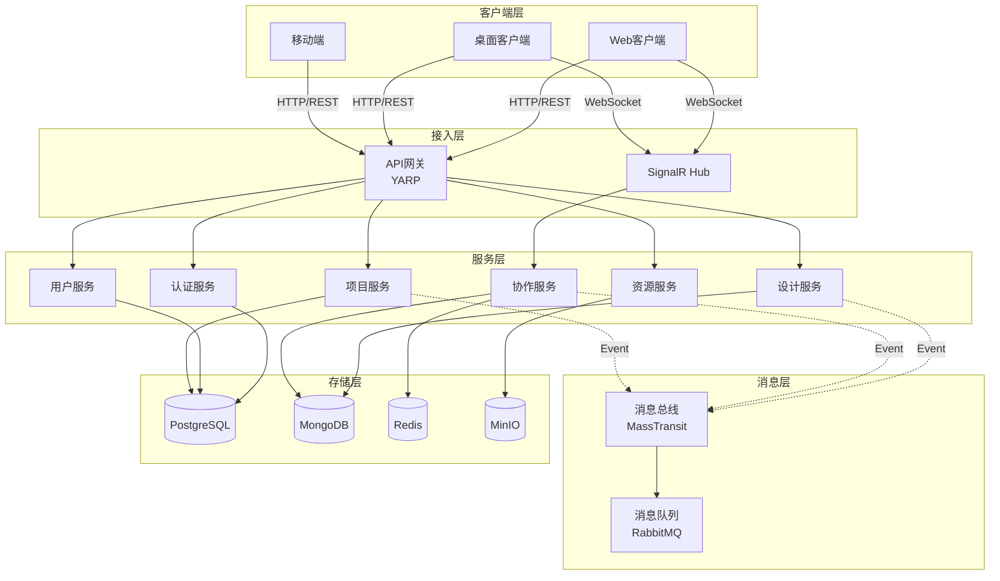

---

## 二、核心业务数据流

### 2.1 用户认证流程

#### 2.1.1 用户登录流程

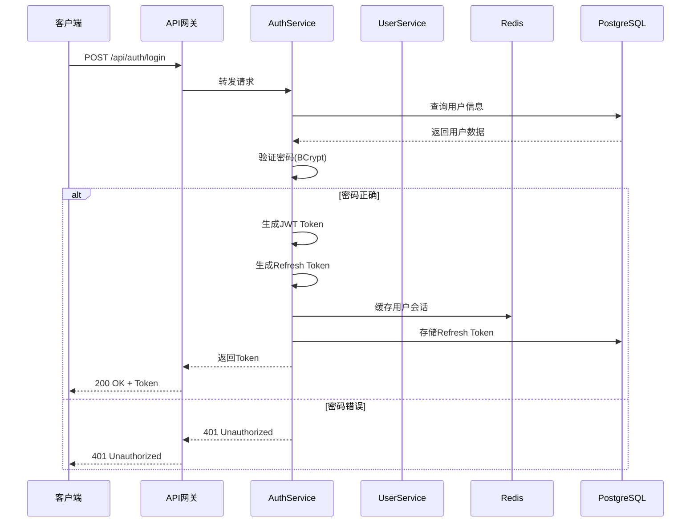

#### 2.1.2 Token 刷新流程

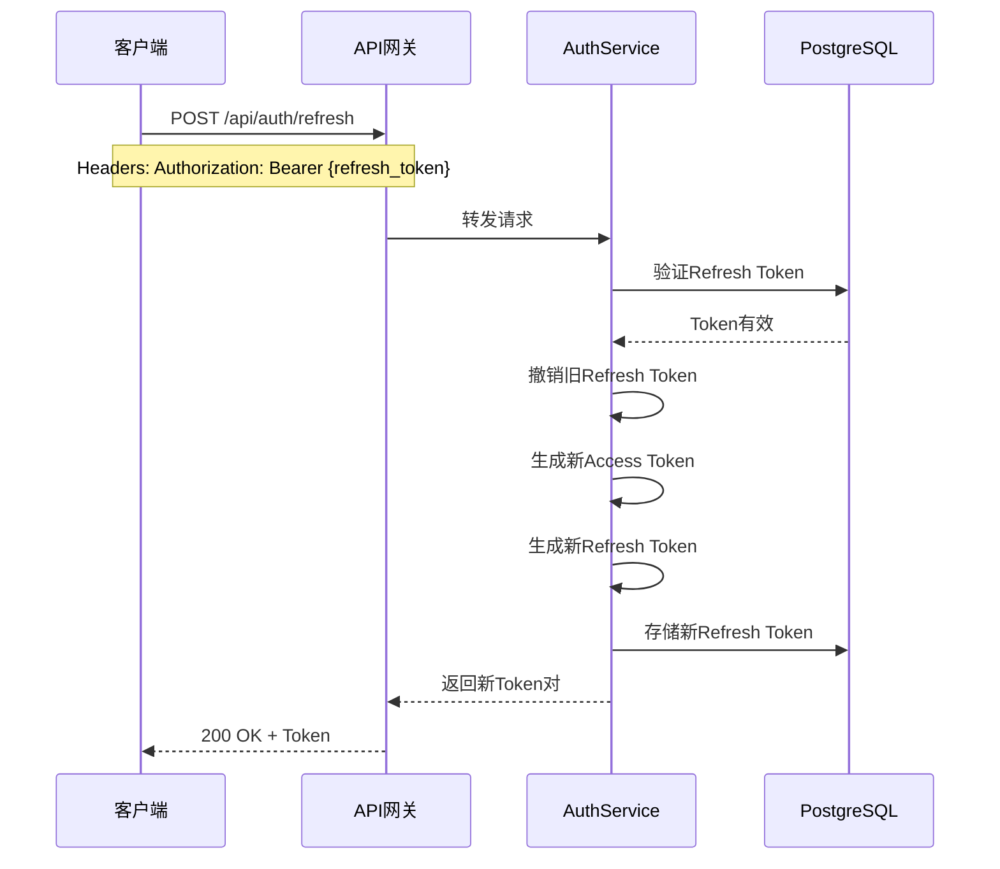

#### 2.1.3 OAuth 第三方登录流程

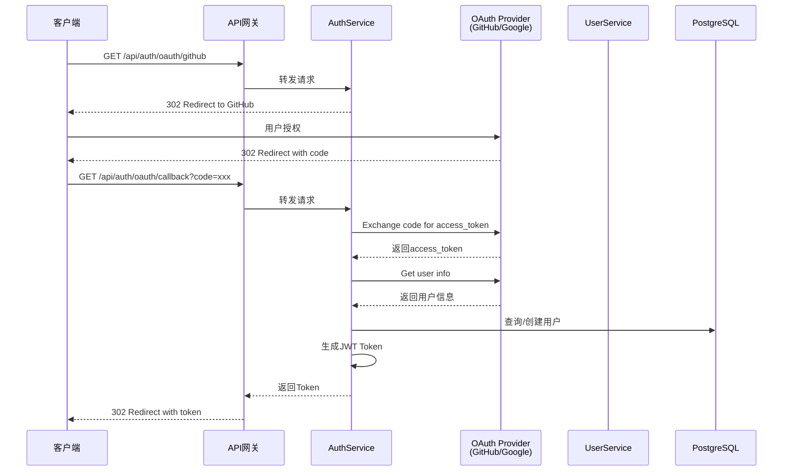

---

### 2.2 设计文档操作流程

#### 2.2.1 创建设计文档

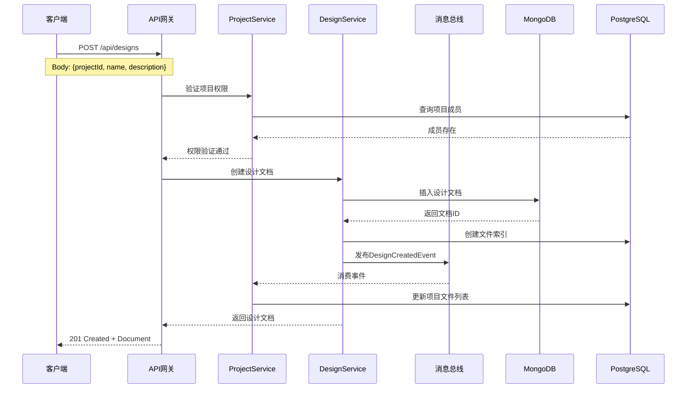

#### 2.2.2 保存设计文档

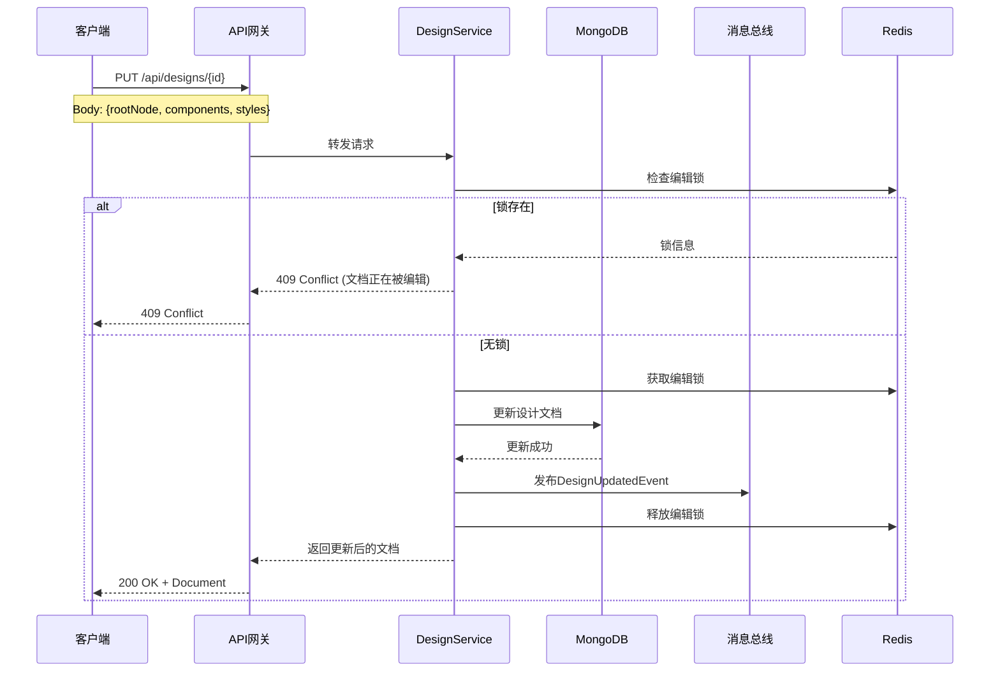

#### 2.2.3 导出设计资源

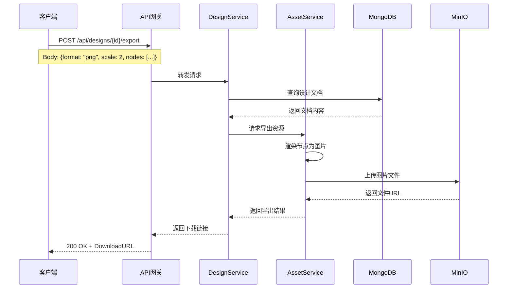

---

### 2.3 实时协作流程

#### 2.3.1 加入协作会话

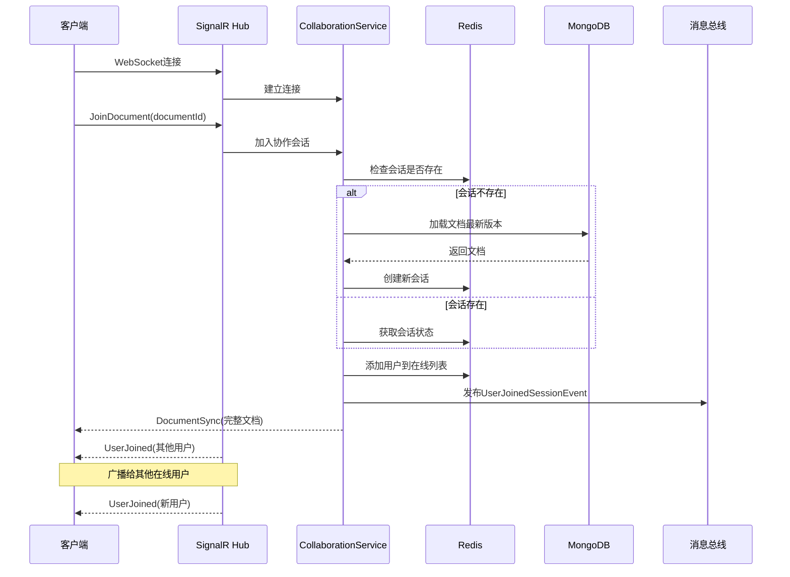

#### 2.3.2 实时编辑操作

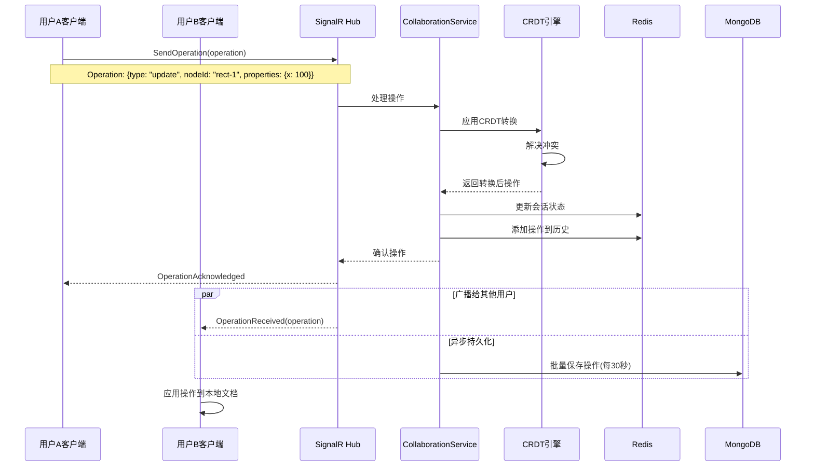

#### 2.3.3 冲突解决流程

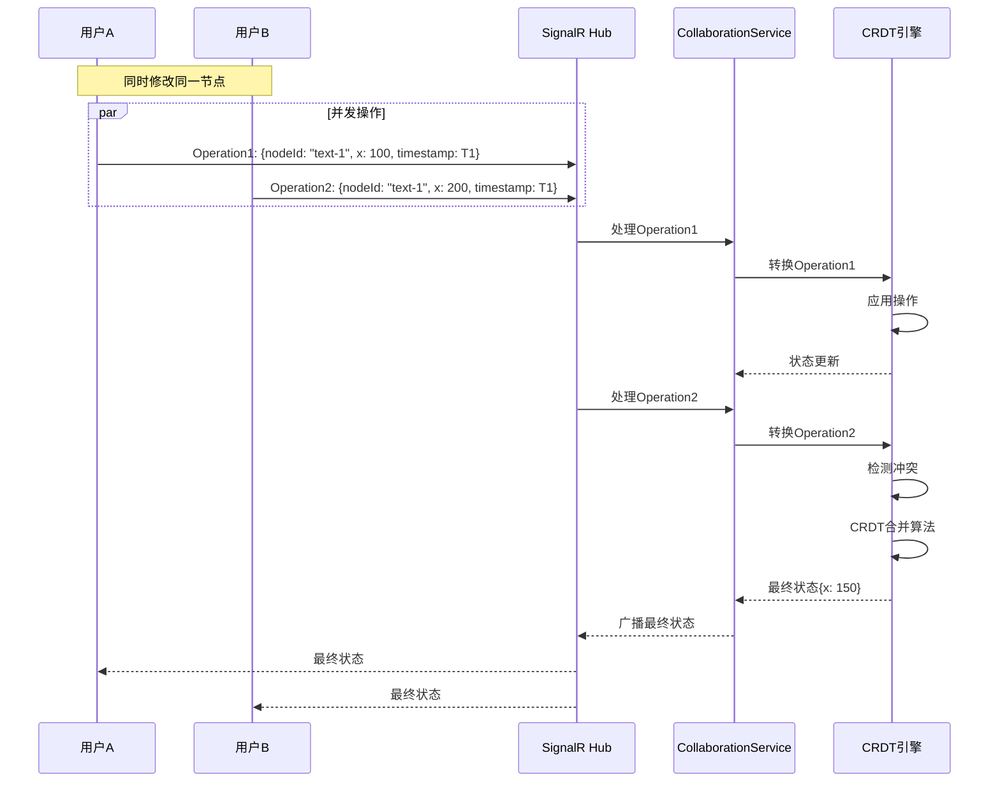

#### 2.3.4 光标同步

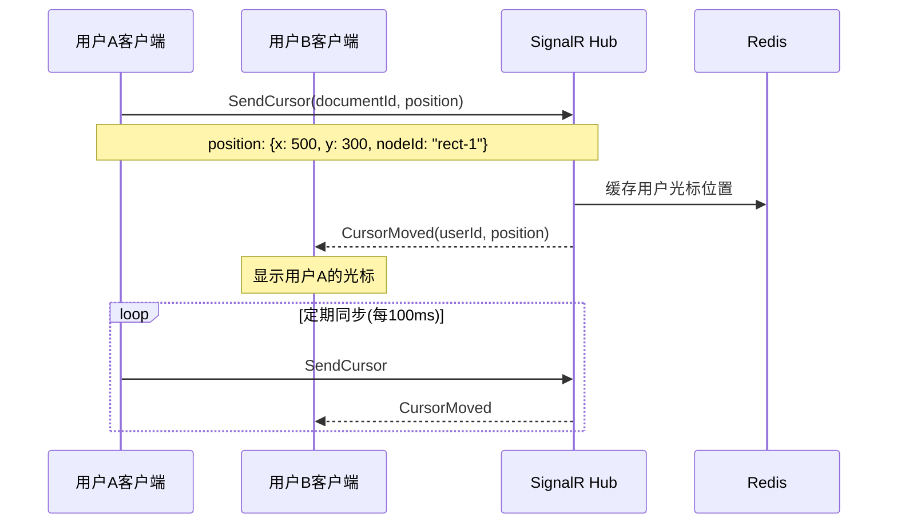

---

### 2.4 资源管理流程

#### 2.4.1 上传资源文件

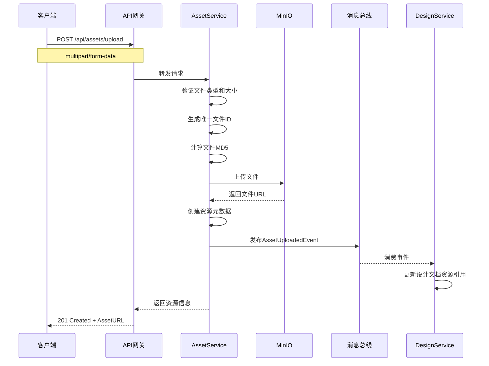

#### 2.4.2 切图导出流程

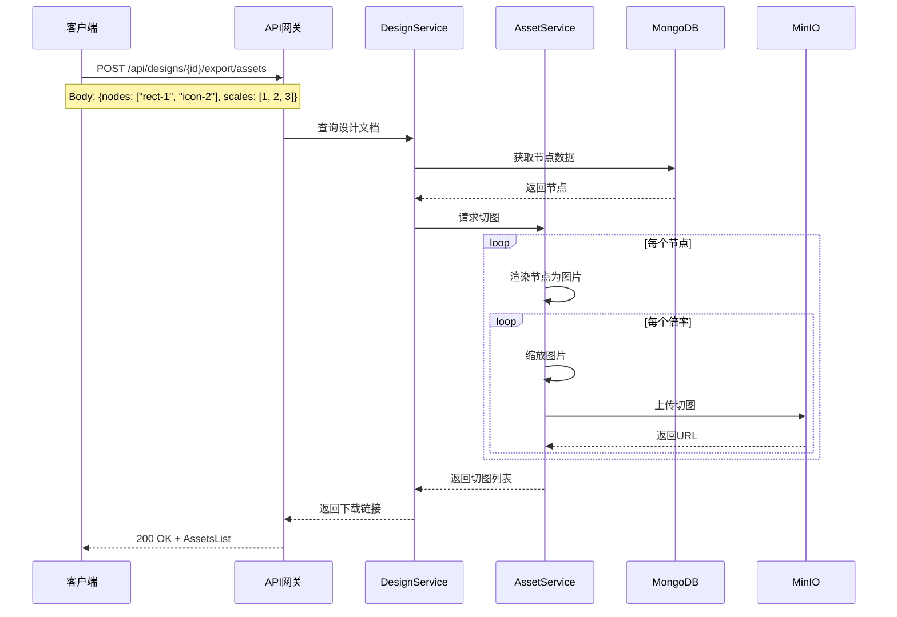

---

## 三、服务间通信机制

### 3.1 同步通信 - gRPC

#### 3.1.1 gRPC 服务定义

```protobuf
// Protos/design.proto
syntax = "proto3";

package clawflgma.design;

service DesignService {
  // 获取设计文档
  rpc GetDesign (GetDesignRequest) returns (DesignResponse);
  
  // 批量获取设计文档
  rpc GetDesigns (GetDesignsRequest) returns (DesignsResponse);
  
  // 更新设计文档
  rpc UpdateDesign (UpdateDesignRequest) returns (DesignResponse);
  
  // 流式更新推送
  rpc StreamUpdates (StreamRequest) returns (stream DesignUpdate);
}

message GetDesignRequest {
  string design_id = 1;
  int32 version = 2;  // 可选版本号
}

message DesignResponse {
  string id = 1;
  string project_id = 2;
  string name = 3;
  bytes content = 4;  // JSON序列化内容
  int32 version = 5;
  int64 last_modified = 6;
}

message StreamRequest {
  string design_id = 1;
  int32 from_version = 2;
}

message DesignUpdate {
  string design_id = 1;
  int32 version = 2;
  string operation_type = 3;  // insert, update, delete
  bytes delta = 4;  // 增量数据
}
```

#### 3.1.2 gRPC 客户端调用

```csharp
// CollaborationService/Services/DesignClient.cs
public class DesignClient
{
    private readonly DesignService.DesignServiceClient _client;
    
    public async Task<DesignDocument> GetDesignAsync(string designId, int? version = null)
    {
        var request = new GetDesignRequest
        {
            DesignId = designId,
            Version = version ?? 0
        };
        
        var response = await _client.GetDesignAsync(request);
        
        return JsonSerializer.Deserialize<DesignDocument>(response.Content);
    }
    
    public async IAsyncEnumerable<DesignUpdate> StreamUpdatesAsync(
        string designId, 
        int fromVersion)
    {
        var request = new StreamRequest
        {
            DesignId = designId,
            FromVersion = fromVersion
        };
        
        using var call = _client.StreamUpdates(request);
        
        await foreach (var update in call.ResponseStream.ReadAllAsync())
        {
            yield return update;
        }
    }
}
```

#### 3.1.3 gRPC 性能优化

```csharp
// 配置 gRPC 客户端
builder.Services.AddGrpcClient<DesignService.DesignServiceClient>(o =>
{
    o.Address = new Uri("https://design-service");
})
.ConfigureChannel(o =>
{
    // 启用 HTTP/2 多路复用
    o.HttpHandler = new SocketsHttpHandler
    {
        EnableMultipleHttp2Connections = true,
        PooledConnectionIdleTimeout = Timeout.InfiniteTimeSpan,
        KeepAlivePingDelay = TimeSpan.FromSeconds(60),
        KeepAlivePingTimeout = TimeSpan.FromSeconds(30)
    };
});
```

---

### 3.2 异步通信 - 消息队列

#### 3.2.1 事件定义

```csharp
// Shared/Events/DesignEvents.cs
namespace ClawFlgma.Shared.Events;

// 设计文档创建事件
public record DesignCreatedEvent(
    string DesignId,
    string ProjectId,
    string Name,
    string UserId,
    DateTime Timestamp
);

// 设计文档更新事件
public record DesignUpdatedEvent(
    string DesignId,
    string ProjectId,
    List<string> ChangedNodes,
    int NewVersion,
    string UserId,
    DateTime Timestamp
);

// 设计文档删除事件
public record DesignDeletedEvent(
    string DesignId,
    string ProjectId,
    string UserId,
    DateTime Timestamp
);

// 协作会话事件
public record CollaborationSessionStartedEvent(
    string SessionId,
    string DocumentId,
    string UserId,
    DateTime Timestamp
);

public record UserJoinedSessionEvent(
    string SessionId,
    string DocumentId,
    string UserId,
    string UserName,
    DateTime Timestamp
);

// 资源事件
public record AssetUploadedEvent(
    string AssetId,
    string FileName,
    string FileUrl,
    long FileSize,
    string UserId,
    DateTime Timestamp
);
```

#### 3.2.2 消息发布

```csharp
// DesignService/Services/DesignEventPublisher.cs
public class DesignEventPublisher
{
    private readonly IBus _bus;
    private readonly ILogger<DesignEventPublisher> _logger;
    
    public async Task PublishDesignCreatedAsync(
        string designId, 
        string projectId, 
        string name,
        string userId)
    {
        var @event = new DesignCreatedEvent(
            designId,
            projectId,
            name,
            userId,
            DateTime.UtcNow
        );
        
        await _bus.Publish(@event);
        
        _logger.LogInformation(
            "Published DesignCreatedEvent for {DesignId}",
            designId
        );
    }
    
    public async Task PublishDesignUpdatedAsync(
        string designId,
        string projectId,
        List<string> changedNodes,
        int newVersion,
        string userId)
    {
        var @event = new DesignUpdatedEvent(
            designId,
            projectId,
            changedNodes,
            newVersion,
            userId,
            DateTime.UtcNow
        );
        
        await _bus.Publish(@event);
    }
}
```

#### 3.2.3 消息消费

```csharp
// NotificationService/Consumers/DesignEventConsumer.cs
public class DesignEventConsumer : 
    IConsumer<DesignCreatedEvent>,
    IConsumer<DesignUpdatedEvent>
{
    private readonly INotificationService _notificationService;
    private readonly ILogger<DesignEventConsumer> _logger;
    
    public async Task Consume(ConsumeContext<DesignCreatedEvent> context)
    {
        var message = context.Message;
        
        _logger.LogInformation(
            "Consuming DesignCreatedEvent: {DesignId}",
            message.DesignId
        );
        
        // 发送通知给项目成员
        await _notificationService.SendNotificationAsync(new Notification
        {
            Type = NotificationType.DesignCreated,
            Title = "新设计已创建",
            Message = $"设计 '{message.Name}' 已创建",
            RecipientIds = await GetProjectMembers(message.ProjectId),
            Data = new { designId = message.DesignId }
        });
    }
    
    public async Task Consume(ConsumeContext<DesignUpdatedEvent> context)
    {
        var message = context.Message;
        
        // 发送更新通知
        await _notificationService.SendNotificationAsync(new Notification
        {
            Type = NotificationType.DesignUpdated,
            Title = "设计已更新",
            Message = $"设计已更新，版本: {message.NewVersion}",
            RecipientIds = await GetProjectMembers(message.ProjectId),
            Data = new 
            { 
                designId = message.DesignId,
                version = message.NewVersion
            }
        });
    }
}
```

#### 3.2.4 消息队列配置

```csharp
// Extensions/MassTransitExtensions.cs
public static class MassTransitExtensions
{
    public static void AddMassTransitConfiguration(
        this IServiceCollection services,
        IConfiguration configuration)
    {
        services.AddMassTransit(x =>
        {
            // 注册消费者
            x.AddConsumer<DesignEventConsumer>();
            x.AddConsumer<CollaborationEventConsumer>();
            
            x.UsingRabbitMq((context, cfg) =>
            {
                cfg.Host(configuration["RabbitMQ:Host"], "/", h =>
                {
                    h.Username(configuration["RabbitMQ:Username"]);
                    h.Password(configuration["RabbitMQ:Password"]);
                });
                
                // 配置重试策略
                cfg.UseMessageRetry(r => r.Intervals(
                    TimeSpan.FromSeconds(1),
                    TimeSpan.FromSeconds(5),
                    TimeSpan.FromSeconds(15)
                ));
                
                // 配置消息过期时间
                cfg.Message<DesignUpdatedEvent>(e => 
                    e.SetTimeToLive(TimeSpan.FromHours(24)));
                
                // 配置端点
                cfg.ReceiveEndpoint("notification-queue", e =>
                {
                    e.ConfigureConsumer<DesignEventConsumer>(context);
                });
            });
        });
    }
}
```

---

### 3.3 实时通信 - SignalR

#### 3.3.1 SignalR Hub 实现

```csharp
// CollaborationService/Hubs/CollaborationHub.cs
[Authorize]
public class CollaborationHub : Hub
{
    private readonly ICollaborationService _collabService;
    private readonly ILogger<CollaborationHub> _logger;
    
    // 加入文档协作
    public async Task JoinDocument(string documentId)
    {
        var userId = Context.UserIdentifier;
        
        // 验证权限
        if (!await _collabService.CanAccessDocument(userId, documentId))
        {
            throw new HubException("无权访问该文档");
        }
        
        // 加入组
        await Groups.AddToGroupAsync(Context.ConnectionId, documentId);
        
        // 加载文档状态
        var docState = await _collabService.GetDocumentStateAsync(documentId);
        await Clients.Caller.SendAsync("DocumentSync", docState);
        
        // 获取在线用户
        var onlineUsers = await _collabService.GetOnlineUsersAsync(documentId);
        await Clients.Caller.SendAsync("OnlineUsers", onlineUsers);
        
        // 通知其他用户
        var user = await _collabService.GetUserAsync(userId);
        await Clients.OthersInGroup(documentId).SendAsync("UserJoined", user);
        
        _logger.LogInformation(
            "User {UserId} joined document {DocumentId}",
            userId, documentId
        );
    }
    
    // 发送操作
    public async Task SendOperation(
        string documentId, 
        CollaborationOperation operation)
    {
        var userId = Context.UserIdentifier;
        
        // 设置操作元数据
        operation.UserId = userId;
        operation.Timestamp = DateTimeOffset.UtcNow.ToUnixTimeMilliseconds();
        
        // 应用CRDT转换
        var transformedOp = await _collabService.ApplyOperationAsync(
            documentId, 
            operation
        );
        
        // 广播给其他用户
        await Clients.OthersInGroup(documentId).SendAsync(
            "OperationReceived", 
            transformedOp
        );
        
        // 确认给发送者
        await Clients.Caller.SendAsync(
            "OperationAcknowledged", 
            operation.OperationId
        );
    }
    
    // 发送光标位置
    public async Task SendCursor(string documentId, CursorPosition cursor)
    {
        var userId = Context.UserIdentifier;
        var userName = Context.User.FindFirst("name")?.Value;
        
        await Clients.OthersInGroup(documentId).SendAsync(
            "CursorMoved",
            userId,
            userName,
            cursor
        );
    }
    
    // 离开文档
    public async Task LeaveDocument(string documentId)
    {
        await Groups.RemoveFromGroupAsync(Context.ConnectionId, documentId);
        
        var userId = Context.UserIdentifier;
        await Clients.Group(documentId).SendAsync("UserLeft", userId);
        
        await _collabService.RemoveUserFromSessionAsync(documentId, userId);
    }
    
    // 连接断开
    public override async Task OnDisconnectedAsync(Exception? exception)
    {
        var userId = Context.UserIdentifier;
        
        // 清理用户的所有协作会话
        await _collabService.CleanupUserSessionsAsync(userId);
        
        await base.OnDisconnectedAsync(exception);
    }
}
```

#### 3.3.2 SignalR 客户端实现

```typescript
// frontend/src/collaboration/SignalRClient.ts
import * as signalR from '@microsoft/signalr';
import { CRDTDocument } from './CRDTDocument';

export class CollaborationClient {
  private connection: signalR.HubConnection;
  private document: CRDTDocument;
  
  constructor(documentId: string, accessToken: string) {
    this.connection = new signalR.HubConnectionBuilder()
      .withUrl(`https://api.clawflgma.com/collaboration`, {
        accessTokenFactory: () => accessToken
      })
      .withAutomaticReconnect({
        nextRetryDelayInMilliseconds: retryContext => {
          if (retryContext.previousRetryCount < 5) {
            return 1000 * Math.pow(2, retryContext.previousRetryCount);
          }
          return null; // 放弃重连
        }
      })
      .configureLogging(signalR.LogLevel.Information)
      .build();
    
    this.setupEventHandlers();
  }
  
  private setupEventHandlers() {
    // 文档同步
    this.connection.on('DocumentSync', (docState) => {
      this.document.loadState(docState);
    });
    
    // 接收操作
    this.connection.on('OperationReceived', (operation) => {
      this.document.applyRemoteOperation(operation);
    });
    
    // 操作确认
    this.connection.on('OperationAcknowledged', (operationId) => {
      this.document.confirmOperation(operationId);
    });
    
    // 用户加入
    this.connection.on('UserJoined', (user) => {
      this.emit('userJoined', user);
    });
    
    // 用户离开
    this.connection.on('UserLeft', (userId) => {
      this.emit('userLeft', userId);
    });
    
    // 光标移动
    this.connection.on('CursorMoved', (userId, userName, cursor) => {
      this.emit('cursorMoved', { userId, userName, cursor });
    });
  }
  
  // 连接
  async connect(): Promise<void> {
    await this.connection.start();
  }
  
  // 加入文档
  async joinDocument(documentId: string): Promise<void> {
    await this.connection.invoke('JoinDocument', documentId);
  }
  
  // 发送操作
  async sendOperation(operation: CollaborationOperation): Promise<void> {
    await this.connection.invoke('SendOperation', operation);
  }
  
  // 发送光标
  async sendCursor(cursor: CursorPosition): Promise<void> {
    await this.connection.invoke('SendCursor', cursor);
  }
  
  // 断开连接
  async disconnect(): Promise<void> {
    await this.connection.stop();
  }
}
```

---

## 四、数据一致性保证

### 4.1 最终一致性模型

#### 4.1.1 CRDT 算法实现

```typescript
// frontend/src/collaboration/CRDTDocument.ts
import * as Y from 'yjs';

export class CRDTDocument {
  private ydoc: Y.Doc;
  private ynodes: Y.Map<CanvasNode>;
  private ycomponents: Y.Map<ComponentDefinition>;
  
  constructor() {
    this.ydoc = new Y.Doc();
    this.ynodes = this.ydoc.getMap('nodes');
    this.ycomponents = this.ydoc.getMap('components');
    
    // 监听远程更新
    this.ydoc.on('update', (update: Uint8Array, origin: any) => {
      if (origin !== 'local') {
        this.emit('remoteUpdate', update);
      }
    });
  }
  
  // 应用远程更新
  applyRemoteUpdate(update: Uint8Array): void {
    Y.applyUpdate(this.ydoc, update, 'remote');
  }
  
  // 获取本地更新
  getLocalUpdate(): Uint8Array {
    return Y.encodeStateAsUpdate(this.ydoc);
  }
  
  // 创建节点
  createNode(node: CanvasNode): void {
    this.ynodes.set(node.id, node);
  }
  
  // 更新节点属性
  updateNodeProperty(nodeId: string, property: string, value: any): void {
    const node = this.ynodes.get(nodeId);
    if (node) {
      node.properties[property] = value;
      this.ynodes.set(nodeId, node);
    }
  }
  
  // 删除节点
  deleteNode(nodeId: string): void {
    this.ynodes.delete(nodeId);
  }
  
  // 合并状态
  merge(otherUpdate: Uint8Array): void {
    Y.applyUpdate(this.ydoc, otherUpdate);
  }
}
```

#### 4.1.2 操作转换(OT)算法

```csharp
// CollaborationService/Services/OTEngine.cs
public class OTEngine
{
    // 转换操作
    public CollaborationOperation Transform(
        CollaborationOperation op1,
        CollaborationOperation op2)
    {
        // 如果操作针对不同节点,无需转换
        if (op1.TargetNodeId != op2.TargetNodeId)
        {
            return op1;
        }
        
        // 根据操作类型转换
        return (op1.Type, op2.Type) switch
        {
            (OperationType.Update, OperationType.Update) => 
                TransformUpdateUpdate(op1, op2),
            
            (OperationType.Move, OperationType.Move) => 
                TransformMoveMove(op1, op2),
            
            (OperationType.Delete, _) => op1,
            
            (_, OperationType.Delete) => 
                throw new InvalidOperationException("节点已被删除"),
            
            _ => op1
        };
    }
    
    private CollaborationOperation TransformUpdateUpdate(
        CollaborationOperation op1,
        CollaborationOperation op2)
    {
        var transformedProps = new Dictionary<string, object>();
        
        foreach (var prop in op1.Properties)
        {
            // 如果属性未被op2修改,保留
            if (!op2.Properties.ContainsKey(prop.Key))
            {
                transformedProps[prop.Key] = prop.Value;
            }
            // 否则保留op1的修改(最后写入者获胜)
            else
            {
                transformedProps[prop.Key] = prop.Value;
            }
        }
        
        return op1 with { Properties = transformedProps };
    }
}
```

### 4.2 分布式事务

#### 4.2.1 Saga 模式实现

```csharp
// 设计文档创建Saga
public class CreateDesignSaga
{
    private readonly ILogger<CreateDesignSaga> _logger;
    
    public async Task<DesignDocument> ExecuteAsync(CreateDesignRequest request)
    {
        var sagaId = Guid.NewGuid();
        
        try
        {
            // 步骤1: 创建设计文档
            var document = await CreateDesignDocumentAsync(request);
            
            // 步骤2: 创建文件索引
            await CreateFileIndexAsync(document);
            
            // 步骤3: 更新项目统计
            await UpdateProjectStatsAsync(request.ProjectId);
            
            // 步骤4: 发送通知
            await SendNotificationAsync(document);
            
            return document;
        }
        catch (Exception ex)
        {
            _logger.LogError(ex, "Saga {SagaId} failed, compensating...", sagaId);
            
            // 补偿操作
            await CompensateAsync(sagaId);
            
            throw;
        }
    }
    
    private async Task CompensateAsync(Guid sagaId)
    {
        // 补偿逻辑: 删除已创建的资源
    }
}
```

### 4.3 乐观锁机制

```csharp
// DesignService/Services/DesignService.cs
public async Task<DesignDocument> UpdateDesignAsync(
    string designId,
    UpdateDesignRequest request)
{
    var document = await _repository.GetAsync(designId);
    
    // 乐观锁检查
    if (document.Version != request.ExpectedVersion)
    {
        throw new ConcurrencyException(
            $"文档版本不匹配,当前版本: {document.Version}, " +
            $"预期版本: {request.ExpectedVersion}"
        );
    }
    
    // 更新文档
    document.RootNode = request.RootNode;
    document.Version++;
    document.LastModified = DateTime.UtcNow;
    
    await _repository.UpdateAsync(document);
    
    return document;
}
```

---

## 五、性能优化策略

### 5.1 数据缓存策略

#### 5.1.1 多级缓存架构

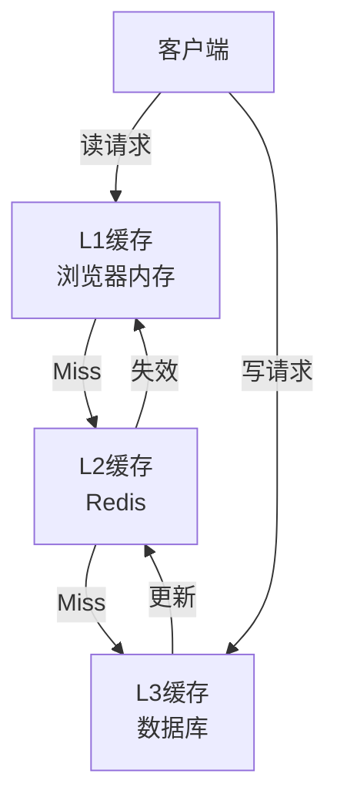

#### 5.1.2 缓存实现

```csharp
// Services/CacheService.cs
public class CacheService : ICacheService
{
    private readonly IDistributedCache _distributedCache;
    private readonly IMemoryCache _memoryCache;
    
    public async Task<T?> GetAsync<T>(string key) where T : class
    {
        // L1: 内存缓存
        if (_memoryCache.TryGetValue(key, out T? value))
        {
            return value;
        }
        
        // L2: Redis缓存
        var json = await _distributedCache.GetStringAsync(key);
        if (json != null)
        {
            value = JsonSerializer.Deserialize<T>(json);
            _memoryCache.Set(key, value, TimeSpan.FromMinutes(5));
            return value;
        }
        
        return null;
    }
    
    public async Task SetAsync<T>(
        string key, 
        T value, 
        TimeSpan? expiration = null) where T : class
    {
        var json = JsonSerializer.Serialize(value);
        
        // 设置Redis缓存
        await _distributedCache.SetStringAsync(
            key, 
            json,
            new DistributedCacheEntryOptions
            {
                AbsoluteExpirationRelativeToNow = expiration ?? TimeSpan.FromMinutes(10)
            }
        );
        
        // 设置内存缓存
        _memoryCache.Set(key, value, TimeSpan.FromMinutes(5));
    }
    
    public async Task RemoveAsync(string key)
    {
        await _distributedCache.RemoveAsync(key);
        _memoryCache.Remove(key);
    }
}
```

### 5.2 批量操作优化

#### 5.2.1 批量保存操作

```csharp
// CollaborationService/Services/OperationBatchService.cs
public class OperationBatchService : BackgroundService
{
    private readonly ConcurrentQueue<CollaborationOperation> _operationQueue = new();
    private readonly IServiceScopeFactory _scopeFactory;
    
    public void EnqueueOperation(CollaborationOperation operation)
    {
        _operationQueue.Enqueue(operation);
    }
    
    protected override async Task ExecuteAsync(CancellationToken stoppingToken)
    {
        while (!stoppingToken.IsCancellationRequested)
        {
            // 每30秒批量保存
            await Task.Delay(TimeSpan.FromSeconds(30), stoppingToken);
            
            if (_operationQueue.TryDequeue(out var operations))
            {
                await SaveOperationsBatchAsync(operations);
            }
        }
    }
    
    private async Task SaveOperationsBatchAsync(
        IEnumerable<CollaborationOperation> operations)
    {
        using var scope = _scopeFactory.CreateScope();
        var mongoClient = scope.ServiceProvider.GetRequiredService<IMongoClient>();
        
        var batch = operations
            .GroupBy(op => op.DocumentId)
            .Select(g => new BulkWriteModel<CollaborationOperation>
            {
                Filter = Builders<CollaborationOperation>.Filter.Eq(
                    op => op.DocumentId, g.Key),
                Update = Builders<CollaborationOperation>.Update
                    .PushEach(op => op.Operations, g.ToList())
            });
        
        await mongoClient.GetDatabase("clawflgma")
            .GetCollection<CollaborationOperation>("operations")
            .BulkWriteAsync(batch);
    }
}
```

### 5.3 连接池优化

```csharp
// 配置连接池
builder.Services.AddMongoDB(builder.Configuration["MongoDB:ConnectionString"], options =>
{
    options.MaxConnectionPoolSize = 100;
    options.MinConnectionPoolSize = 10;
    options.MaxConnectionIdleTime = TimeSpan.FromMinutes(5);
    options.MaxConnectionLifeTime = TimeSpan.FromMinutes(30);
});

builder.Services.AddRedis(builder.Configuration["Redis:ConnectionString"], options =>
{
    options.SyncTimeout = 5000;
    options.AsyncTimeout = 5000;
    options.ConnectRetry = 3;
    options.KeepAlive = 180;
});
```

---

## 六、监控与诊断

### 6.1 数据流监控

```csharp
// 中间件: 请求监控
public class RequestMonitoringMiddleware
{
    private readonly RequestDelegate _next;
    private readonly ILogger<RequestMonitoringMiddleware> _logger;
    
    public async Task InvokeAsync(HttpContext context)
    {
        var stopwatch = Stopwatch.StartNew();
        
        try
        {
            await _next(context);
        }
        finally
        {
            stopwatch.Stop();
            
            var request = context.Request;
            var response = context.Response;
            
            _logger.LogInformation(
                "HTTP {Method} {Path} - {StatusCode} - {ElapsedMilliseconds}ms",
                request.Method,
                request.Path,
                response.StatusCode,
                stopwatch.ElapsedMilliseconds
            );
            
            // 记录慢请求
            if (stopwatch.ElapsedMilliseconds > 1000)
            {
                _logger.LogWarning(
                    "Slow request detected: {Method} {Path} - {ElapsedMilliseconds}ms",
                    request.Method,
                    request.Path,
                    stopwatch.ElapsedMilliseconds
                );
            }
        }
    }
}
```

### 6.2 消息队列监控

```csharp
// MassTransit监控
builder.Services.AddMassTransit(x =>
{
    x.UsingRabbitMq((context, cfg) =>
    {
        // 配置监控
        cfg.ConfigureEndpoints(context, options =>
        {
            options.IncludeDelayedRedeliveries = true;
        });
        
        // 错误队列
        cfg.ConfigureErrorQueueEndpoints = true;
        
        // 性能监控
        cfg.UseInMemoryOutbox();
    });
});
```

---

## 七、容错与恢复

### 7.1 断线重连机制

```typescript
// SignalR自动重连
export class CollaborationClient {
  private setupReconnection(): void {
    this.connection.onclose(async (error) => {
      console.log('Connection closed, attempting to reconnect...', error);
      await this.startWithRetry();
    });
    
    this.connection.onreconnecting((error) => {
      console.log('Reconnecting...', error);
      this.emit('reconnecting');
    });
    
    this.connection.onreconnected((connectionId) => {
      console.log('Reconnected:', connectionId);
      this.emit('reconnected');
      
      // 重新同步文档
      this.syncDocument();
    });
  }
  
  private async startWithRetry(): Promise<void> {
    let retryCount = 0;
    const maxRetries = 5;
    
    while (retryCount < maxRetries) {
      try {
        await this.connection.start();
        console.log('Reconnected successfully');
        return;
      } catch (error) {
        retryCount++;
        const delay = Math.pow(2, retryCount) * 1000;
        console.log(`Retry ${retryCount}/${maxRetries} in ${delay}ms`);
        await new Promise(resolve => setTimeout(resolve, delay));
      }
    }
    
    console.error('Failed to reconnect after max retries');
    this.emit('connectionFailed');
  }
}
```

### 7.2 数据恢复策略

```csharp
// 服务重启后恢复协作会话
public class CollaborationRecoveryService : IHostedService
{
    public async Task StartAsync(CancellationToken cancellationToken)
    {
        // 加载未完成的协作会话
        var activeSessions = await _sessionRepository.GetActiveSessionsAsync();
        
        foreach (var session in activeSessions)
        {
            // 恢复会话状态
            await RestoreSessionAsync(session);
        }
    }
    
    private async Task RestoreSessionAsync(CollaborationSession session)
    {
        // 从MongoDB加载最新文档状态
        var document = await _designService.GetDesignAsync(session.DocumentId);
        
        // 缓存到Redis
        await _cacheService.SetAsync(
            $"session:{session.SessionId}",
            document,
            TimeSpan.FromHours(24)
        );
    }
}
```

---

## 八、安全通信

### 8.1 端到端加密

```csharp
// SignalR消息加密
public class EncryptedHub : Hub
{
    private readonly IEncryptionService _encryptionService;
    
    public async Task SendEncryptedOperation(
        string documentId, 
        string encryptedOperation)
    {
        var userId = Context.UserIdentifier;
        
        // 解密操作
        var operation = await _encryptionService.DecryptAsync(
            encryptedOperation,
            userId
        );
        
        // 处理操作
        var result = await ProcessOperationAsync(documentId, operation);
        
        // 加密结果
        var encryptedResult = await _encryptionService.EncryptAsync(
            result,
            userId
        );
        
        await Clients.Caller.SendAsync("EncryptedResult", encryptedResult);
    }
}
```

### 8.2 数据脱敏

```csharp
// 敏感数据脱敏
public class DataMaskingService
{
    public UserDto MaskSensitiveData(User user)
    {
        return new UserDto
        {
            Id = user.Id,
            Email = MaskEmail(user.Email),
            PhoneNumber = MaskPhone(user.PhoneNumber),
            DisplayName = user.DisplayName
        };
    }
    
    private string MaskEmail(string email)
    {
        var parts = email.Split('@');
        return $"{parts[0].Substring(0, 2)}***@{parts[1]}";
    }
    
    private string MaskPhone(string phone)
    {
        return phone.Length > 7
            ? phone.Substring(0, 3) + "****" + phone.Substring(7)
            : phone;
    }
}
```

---

## 九、总结

本数据流与通信设计文档详细描述了 ClawFlgma 系统的:

✅ **数据流分类**: 同步请求流、实时推送流、异步消息流、数据同步流

✅ **核心业务流程**: 用户认证、设计文档操作、实时协作、资源管理

✅ **通信机制**: gRPC 同步通信、MassTransit 异步消息、SignalR 实时推送

✅ **一致性保证**: CRDT 算法、OT 算法、Saga 模式、乐观锁

✅ **性能优化**: 多级缓存、批量操作、连接池优化

✅ **容错恢复**: 断线重连、数据恢复、监控诊断

✅ **安全保障**: 端到端加密、数据脱敏

下一步将设计 API 接口规范和部署方案。
