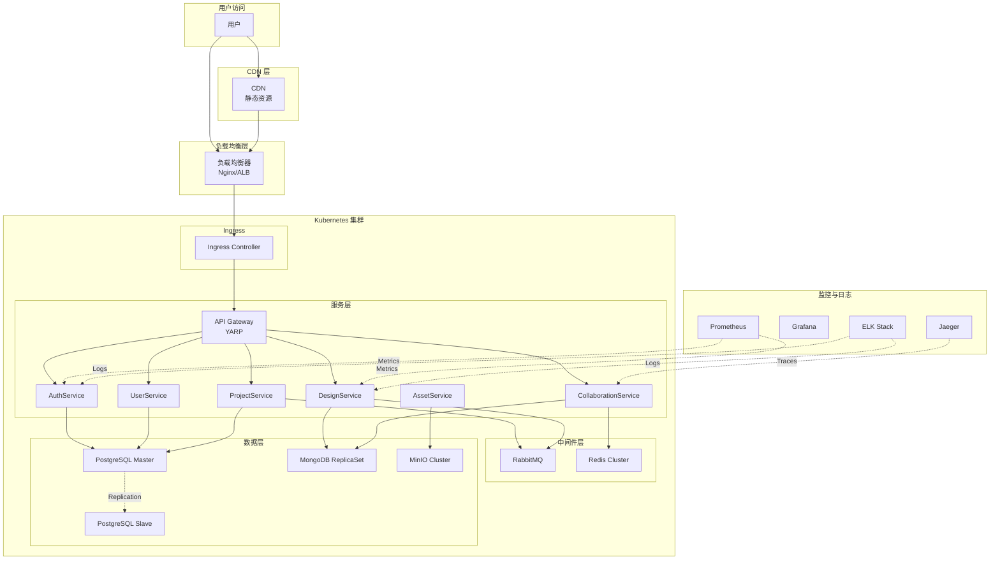

# ClawFlgma 部署与运维指南

## 文档信息

- **项目名称**: ClawFlgma - 云原生设计协作平台
- **版本**: v1.0
- **创建日期**: 2026-03-20
- **适用环境**: Kubernetes、Docker、.NET Aspire
- **相关文档**: [微服务架构设计](./microservices-design.md)

---

## 一、部署架构

### 1.1 部署拓扑图



### 1.2 环境划分

| 环境名称 | 用途 | 域名 | 集群规模 |
|---------|------|------|---------|
| Development | 开发环境 | dev.clawflgma.com | 3 节点 |
| Staging | 预发布环境 | staging.clawflgma.com | 3 节点 |
| Production | 生产环境 | clawflgma.com | 5+ 节点 |
| Production-DR | 灾备环境 | dr.clawflgma.com | 3 节点 |

---

## 二、基础设施配置

### 2.1 Kubernetes 集群配置

#### 2.1.1 生产环境集群配置

```yaml
# cluster-config.yaml
apiVersion: kubeadm.k8s.io/v1beta3
kind: ClusterConfiguration
kubernetesVersion: v1.28.0
controlPlaneEndpoint: "k8s-master.clawflgma.com:6443"
networking:
  podSubnet: "10.244.0.0/16"
  serviceSubnet: "10.96.0.0/12"
apiServer:
  extraArgs:
    enable-admission-plugins: "NodeRestriction,PodSecurityPolicy"
    audit-log-path: "/var/log/kubernetes/audit.log"
---
apiVersion: kubelet.config.k8s.io/v1beta1
kind: KubeletConfiguration
maxPods: 110
systemReserved:
  cpu: "500m"
  memory: "1Gi"
kubeReserved:
  cpu: "500m"
  memory: "1Gi"
```

#### 2.1.2 节点规划

| 节点角色 | 数量 | 配置 | 用途 |
|---------|------|------|------|
| Master | 3 | 4核 8GB | 控制平面 |
| Worker-App | 5+ | 8核 16GB | 应用服务 |
| Worker-Data | 3 | 8核 32GB | 数据库、缓存 |
| Worker-GPU | 2 | 8核 16GB + GPU | AI 服务 |

---

### 2.2 存储配置

#### 2.2.1 持久化存储类

```yaml
# storage-class.yaml
apiVersion: storage.k8s.io/v1
kind: StorageClass
metadata:
  name: fast-ssd
provisioner: kubernetes.io/aws-ebs
parameters:
  type: gp3
  fsType: ext4
reclaimPolicy: Retain
allowVolumeExpansion: true
volumeBindingMode: WaitForFirstConsumer
---
apiVersion: storage.k8s.io/v1
kind: StorageClass
metadata:
  name: standard-hdd
provisioner: kubernetes.io/aws-ebs
parameters:
  type: st1
  fsType: ext4
reclaimPolicy: Retain
allowVolumeExpansion: true
```

#### 2.2.2 存储规划

| 服务 | 存储类型 | 容量 | IOPS |
|------|---------|------|------|
| PostgreSQL | fast-ssd | 500GB | 5000 |
| MongoDB | fast-ssd | 1TB | 5000 |
| Redis | 内存 | 16GB | - |
| MinIO | standard-hdd | 5TB | 1000 |

---

### 2.3 网络配置

#### 2.3.1 Ingress 配置

```yaml
# ingress.yaml
apiVersion: networking.k8s.io/v1
kind: Ingress
metadata:
  name: clawflgma-ingress
  namespace: clawflgma
  annotations:
    kubernetes.io/ingress.class: nginx
    cert-manager.io/cluster-issuer: letsencrypt-prod
    nginx.ingress.kubernetes.io/ssl-redirect: "true"
    nginx.ingress.kubernetes.io/proxy-body-size: "50m"
    nginx.ingress.kubernetes.io/websocket-services: collaboration-service
spec:
  tls:
  - hosts:
    - api.clawflgma.com
    - clawflgma.com
    secretName: clawflgma-tls
  rules:
  - host: api.clawflgma.com
    http:
      paths:
      - path: /
        pathType: Prefix
        backend:
          service:
            name: api-gateway
            port:
              number: 80
  - host: clawflgma.com
    http:
      paths:
      - path: /
        pathType: Prefix
        backend:
          service:
            name: frontend
            port:
              number: 80
```

#### 2.3.2 网络策略

```yaml
# network-policy.yaml
apiVersion: networking.k8s.io/v1
kind: NetworkPolicy
metadata:
  name: design-service-policy
  namespace: clawflgma
spec:
  podSelector:
    matchLabels:
      app: design-service
  policyTypes:
  - Ingress
  - Egress
  ingress:
  - from:
    - podSelector:
        matchLabels:
          app: api-gateway
    - podSelector:
        matchLabels:
          app: collaboration-service
    ports:
    - protocol: TCP
      port: 8080
  egress:
  - to:
    - podSelector:
        matchLabels:
          app: mongodb
    ports:
    - protocol: TCP
      port: 27017
  - to:
    - podSelector:
        matchLabels:
          app: redis
    ports:
    - protocol: TCP
      port: 6379
```

---

## 三、容器化部署

### 3.1 Dockerfile 示例

#### 3.1.1 设计服务 Dockerfile

```dockerfile
# src/Services/DesignService/Dockerfile
FROM mcr.microsoft.com/dotnet/aspnet:10.0 AS base
WORKDIR /app
EXPOSE 8080
EXPOSE 8443

FROM mcr.microsoft.com/dotnet/sdk:10.0 AS build
WORKDIR /src
COPY ["Services/DesignService/DesignService.csproj", "Services/DesignService/"]
COPY ["Shared/SharedKernel/SharedKernel.csproj", "Shared/SharedKernel/"]
RUN dotnet restore "Services/DesignService/DesignService.csproj"
COPY . .
WORKDIR "/src/Services/DesignService"
RUN dotnet build "DesignService.csproj" -c Release -o /app/build

FROM build AS publish
RUN dotnet publish "DesignService.csproj" -c Release -o /app/publish /p:UseAppHost=false

FROM base AS final
WORKDIR /app
COPY --from=publish /app/publish .
ENTRYPOINT ["dotnet", "DesignService.dll"]
```

#### 3.1.2 前端应用 Dockerfile

```dockerfile
# frontend/Dockerfile
FROM node:18-alpine AS builder
WORKDIR /app
COPY package*.json ./
RUN npm ci --only=production
COPY . .
RUN npm run build

FROM nginx:alpine
COPY --from=builder /app/dist /usr/share/nginx/html
COPY nginx.conf /etc/nginx/nginx.conf
EXPOSE 80
CMD ["nginx", "-g", "daemon off;"]
```

---

### 3.2 Kubernetes 部署清单

#### 3.2.1 设计服务部署

```yaml
# deploy/kubernetes/design-service.yaml
apiVersion: apps/v1
kind: Deployment
metadata:
  name: design-service
  namespace: clawflgma
  labels:
    app: design-service
    version: v1.0.0
spec:
  replicas: 3
  selector:
    matchLabels:
      app: design-service
  strategy:
    type: RollingUpdate
    rollingUpdate:
      maxSurge: 1
      maxUnavailable: 0
  template:
    metadata:
      labels:
        app: design-service
        version: v1.0.0
      annotations:
        prometheus.io/scrape: "true"
        prometheus.io/port: "8080"
        prometheus.io/path: "/metrics"
    spec:
      containers:
      - name: design-service
        image: clawflgma/design-service:v1.0.0
        imagePullPolicy: Always
        ports:
        - containerPort: 8080
          name: http
          protocol: TCP
        - containerPort: 8443
          name: grpc
          protocol: TCP
        env:
        - name: ASPNETCORE_ENVIRONMENT
          value: Production
        - name: MongoDB__ConnectionString
          valueFrom:
            secretKeyRef:
              name: mongodb-secret
              key: connection-string
        - name: Redis__ConnectionString
          valueFrom:
            secretKeyRef:
              name: redis-secret
              key: connection-string
        - name: RabbitMQ__Host
          value: rabbitmq-service
        resources:
          requests:
            memory: "512Mi"
            cpu: "500m"
          limits:
            memory: "1Gi"
            cpu: "1000m"
        livenessProbe:
          httpGet:
            path: /health/live
            port: 8080
          initialDelaySeconds: 30
          periodSeconds: 10
          timeoutSeconds: 5
          failureThreshold: 3
        readinessProbe:
          httpGet:
            path: /health/ready
            port: 8000
          initialDelaySeconds: 5
          periodSeconds: 5
          timeoutSeconds: 3
          failureThreshold: 3
        volumeMounts:
        - name: appsettings
          mountPath: /app/appsettings.Production.json
          subPath: appsettings.Production.json
      volumes:
      - name: appsettings
        configMap:
          name: design-service-config
      affinity:
        podAntiAffinity:
          preferredDuringSchedulingIgnoredDuringExecution:
          - weight: 100
            podAffinityTerm:
              labelSelector:
                matchExpressions:
                - key: app
                  operator: In
                  values:
                  - design-service
              topologyKey: kubernetes.io/hostname
---
apiVersion: v1
kind: Service
metadata:
  name: design-service
  namespace: clawflgma
spec:
  type: ClusterIP
  selector:
    app: design-service
  ports:
  - name: http
    port: 80
    targetPort: 8080
    protocol: TCP
  - name: grpc
    port: 443
    targetPort: 8443
    protocol: TCP
---
apiVersion: autoscaling/v2
kind: HorizontalPodAutoscaler
metadata:
  name: design-service-hpa
  namespace: clawflgma
spec:
  scaleTargetRef:
    apiVersion: apps/v1
    kind: Deployment
    name: design-service
  minReplicas: 3
  maxReplicas: 10
  metrics:
  - type: Resource
    resource:
      name: cpu
      target:
        type: Utilization
        averageUtilization: 70
  - type: Resource
    resource:
      name: memory
      target:
        type: Utilization
        averageUtilization: 80
```

#### 3.2.2 协作服务部署(WebSocket)

```yaml
# deploy/kubernetes/collaboration-service.yaml
apiVersion: apps/v1
kind: Deployment
metadata:
  name: collaboration-service
  namespace: clawflgma
spec:
  replicas: 3
  selector:
    matchLabels:
      app: collaboration-service
  template:
    metadata:
      labels:
        app: collaboration-service
    spec:
      containers:
      - name: collaboration-service
        image: clawflgma/collaboration-service:v1.0.0
        ports:
        - containerPort: 8080
          name: http
        env:
        - name: ASPNETCORE_ENVIRONMENT
          value: Production
        - name: SignalR__EnableDetailedErrors
          value: "false"
        - name: Redis__ConnectionString
          valueFrom:
            secretKeyRef:
              name: redis-secret
              key: connection-string
        resources:
          requests:
            memory: "1Gi"
            cpu: "1000m"
          limits:
            memory: "2Gi"
            cpu: "2000m"
        lifecycle:
          preStop:
            exec:
              command: ["/bin/sh", "-c", "sleep 15"]
---
apiVersion: v1
kind: Service
metadata:
  name: collaboration-service
  namespace: clawflgma
  annotations:
    nginx.ingress.kubernetes.io/affinity: "cookie"
    nginx.ingress.kubernetes.io/session-cookie-name: "route"
    nginx.ingress.kubernetes.io/session-cookie-hash: "sha1"
spec:
  type: ClusterIP
  selector:
    app: collaboration-service
  ports:
  - name: http
    port: 80
    targetPort: 8080
```

---

### 3.3 ConfigMap 和 Secret

#### 3.3.1 ConfigMap

```yaml
# deploy/kubernetes/configmap.yaml
apiVersion: v1
kind: ConfigMap
metadata:
  name: design-service-config
  namespace: clawflgma
data:
  appsettings.Production.json: |
    {
      "Logging": {
        "LogLevel": {
          "Default": "Information",
          "Microsoft": "Warning"
        }
      },
      "MongoDB": {
        "Database": "ClawFlgmaDesigns"
      },
      "Redis": {
        "InstanceName": "DesignService:"
      },
      "MassTransit": {
        "Retry": {
          "Count": 3,
          "Interval": "00:00:05"
        }
      }
    }
```

#### 3.3.2 Secret

```yaml
# deploy/kubernetes/secret.yaml
apiVersion: v1
kind: Secret
metadata:
  name: mongodb-secret
  namespace: clawflgma
type: Opaque
data:
  connection-string: bW9uZ29kYjovL21vbmdvZGItc2VydmljZToyNzAxNy9DbGF3RmxnbWFEZXNpZ25z
---
apiVersion: v1
kind: Secret
metadata:
  name: redis-secret
  namespace: clawflgma
type: Opaque
data:
  connection-string: cmVkaXM6Ly9yZWRpcy1zZXJ2aWNlOjYzNzk=
```

---

## 四、.NET Aspire 部署

### 4.1 AppHost 配置

```csharp
// src/AppHost/Program.cs
var builder = DistributedApplication.CreateBuilder(args);

// 基础设施
var postgres = builder.AddPostgres("postgres")
    .WithPgAdmin()
    .WithDataVolume("postgres-data");

var redis = builder.AddRedis("redis")
    .WithDataVolume("redis-data");

var rabbitmq = builder.AddRabbitMQ("rabbitmq")
    .WithManagementPlugin();

var mongo = builder.AddMongoDB("mongodb")
    .WithMongoExpress();

// 微服务
var authApi = builder.AddProject<Projects.AuthService>("auth-service")
    .WithReference(postgres)
    .WithReference(redis);

var designApi = builder.AddProject<Projects.DesignService>("design-service")
    .WithReference(mongo)
    .WithReference(redis)
    .WithReference(rabbitmq);

var collabApi = builder.AddProject<Projects.CollaborationService>("collab-service")
    .WithReference(mongo)
    .WithReference(redis)
    .WithReference(rabbitmq);

// API网关
builder.AddProject<Projects.ApiGateway>("api-gateway")
    .WithReference(authApi)
    .WithReference(designApi)
    .WithReference(collabApi);

builder.Build().Run();
```

### 4.2 Azure 部署

```bash
# 使用 Azure Developer CLI 部署
azd init
azd pipeline config
azd deploy
```

---

## 五、CI/CD 流水线

### 5.1 GitLab CI 配置

```yaml
# .gitlab-ci.yml
stages:
  - build
  - test
  - package
  - deploy

variables:
  DOTNET_VERSION: "10.0"
  DOCKER_REGISTRY: "registry.clawflgma.com"

build:
  stage: build
  image: mcr.microsoft.com/dotnet/sdk:10.0
  script:
    - dotnet restore
    - dotnet build --configuration Release --no-restore
  artifacts:
    paths:
      - src/*/bin/Release/
    expire_in: 1 hour

test:
  stage: test
  image: mcr.microsoft.com/dotnet/sdk:10.0
  script:
    - dotnet test --configuration Release --no-build --verbosity normal
  dependencies:
    - build

package:design-service:
  stage: package
  image: docker:latest
  services:
    - docker:dind
  script:
    - docker login -u $CI_REGISTRY_USER -p $CI_REGISTRY_PASSWORD $DOCKER_REGISTRY
    - docker build -t $DOCKER_REGISTRY/clawflgma/design-service:$CI_COMMIT_SHA -f src/Services/DesignService/Dockerfile .
    - docker push $DOCKER_REGISTRY/clawflgma/design-service:$CI_COMMIT_SHA
  only:
    - main
    - develop

deploy:dev:
  stage: deploy
  image: bitnami/kubectl:latest
  script:
    - kubectl config set-cluster k8s-dev --server=$K8S_DEV_SERVER
    - kubectl config set-credentials admin --token=$K8S_DEV_TOKEN
    - kubectl config set-context dev --cluster=k8s-dev --user=admin
    - kubectl config use-context dev
    - kubectl set image deployment/design-service design-service=$DOCKER_REGISTRY/clawflgma/design-service:$CI_COMMIT_SHA -n clawflgma
    - kubectl rollout status deployment/design-service -n clawflgma
  environment:
    name: development
    url: https://dev.clawflgma.com
  only:
    - develop

deploy:prod:
  stage: deploy
  image: bitnami/kubectl:latest
  script:
    - kubectl config set-cluster k8s-prod --server=$K8S_PROD_SERVER
    - kubectl config set-credentials admin --token=$K8S_PROD_TOKEN
    - kubectl config set-context prod --cluster=k8s-prod --user=admin
    - kubectl config use-context prod
    - kubectl set image deployment/design-service design-service=$DOCKER_REGISTRY/clawflgma/design-service:$CI_COMMIT_SHA -n clawflgma
    - kubectl rollout status deployment/design-service -n clawflgma
  environment:
    name: production
    url: https://clawflgma.com
  when: manual
  only:
    - main
```

---

## 六、监控与日志

### 6.1 Prometheus 监控配置

```yaml
# monitoring/prometheus.yaml
apiVersion: v1
kind: ConfigMap
metadata:
  name: prometheus-config
  namespace: monitoring
data:
  prometheus.yml: |
    global:
      scrape_interval: 15s
      evaluation_interval: 15s
    
    scrape_configs:
    - job_name: 'kubernetes-pods'
      kubernetes_sd_configs:
      - role: pod
      relabel_configs:
      - source_labels: [__meta_kubernetes_pod_annotation_prometheus_io_scrape]
        action: keep
        regex: true
      - source_labels: [__meta_kubernetes_pod_annotation_prometheus_io_path]
        action: replace
        target_label: __metrics_path__
        regex: (.+)
      - source_labels: [__address__, __meta_kubernetes_pod_annotation_prometheus_io_port]
        action: replace
        regex: ([^:]+)(?::\d+)?;(\d+)
        replacement: $1:$2
        target_label: __address__
    
    - job_name: 'design-service'
      static_configs:
      - targets: ['design-service:8080']
      metrics_path: '/metrics'
    
    alerting:
      alertmanagers:
      - static_configs:
        - targets:
          - alertmanager:9093
```

### 6.2 Grafana Dashboard

```json
{
  "dashboard": {
    "title": "ClawFlgma Services Dashboard",
    "panels": [
      {
        "title": "Request Rate",
        "type": "graph",
        "targets": [
          {
            "expr": "rate(http_requests_total{service=\"design-service\"}[5m])",
            "legendFormat": "{{service}}"
          }
        ]
      },
      {
        "title": "Response Time",
        "type": "graph",
        "targets": [
          {
            "expr": "histogram_quantile(0.95, rate(http_request_duration_seconds_bucket{service=\"design-service\"}[5m]))",
            "legendFormat": "95th percentile"
          }
        ]
      },
      {
        "title": "Error Rate",
        "type": "graph",
        "targets": [
          {
            "expr": "rate(http_requests_total{service=\"design-service\",status=~\"5..\"}[5m]) / rate(http_requests_total{service=\"design-service\"}[5m])",
            "legendFormat": "Error Rate"
          }
        ]
      }
    ]
  }
}
```

### 6.3 告警规则

```yaml
# monitoring/alert-rules.yaml
apiVersion: v1
kind: ConfigMap
metadata:
  name: alert-rules
  namespace: monitoring
data:
  alert.rules: |
    groups:
    - name: clawflgma.rules
      rules:
      - alert: HighErrorRate
        expr: rate(http_requests_total{status=~"5.."}[5m]) / rate(http_requests_total[5m]) > 0.05
        for: 5m
        labels:
          severity: critical
        annotations:
          summary: High error rate detected
          description: "Service {{ $labels.service }} has error rate > 5%"
      
      - alert: HighResponseTime
        expr: histogram_quantile(0.95, rate(http_request_duration_seconds_bucket[5m])) > 1
        for: 5m
        labels:
          severity: warning
        annotations:
          summary: High response time
          description: "95th percentile response time > 1s for {{ $labels.service }}"
      
      - alert: PodCrashLooping
        expr: rate(kube_pod_container_status_restarts_total[15m]) * 60 * 15 > 0
        for: 5m
        labels:
          severity: critical
        annotations:
          summary: Pod is crash looping
          description: "Pod {{ $labels.pod }} is restarting frequently"
```

---

## 七、性能优化

### 7.1 应用层优化

```csharp
// Program.cs
var builder = WebApplication.CreateBuilder(args);

// 启用响应压缩
builder.Services.AddResponseCompression(options =>
{
    options.EnableForHttps = true;
    options.Providers.Add<BrotliCompressionProvider>();
    options.Providers.Add<GzipCompressionProvider>();
});

// 启用输出缓存
builder.Services.AddOutputCache(options =>
{
    options.AddBasePolicy(builder => builder.Expire(TimeSpan.FromMinutes(10)));
    options.AddPolicy("DesignCache", builder => 
        builder.Expire(TimeSpan.FromMinutes(30)).SetVaryByQuery("version"));
});

var app = builder.Build();

app.UseResponseCompression();
app.UseOutputCache();
```

### 7.2 数据库优化

```sql
-- PostgreSQL 索引优化
CREATE INDEX idx_users_email ON users(email);
CREATE INDEX idx_projects_owner ON projects(owner_id);
CREATE INDEX idx_projects_created ON projects(created_at DESC);
CREATE INDEX idx_project_members_composite ON project_members(project_id, user_id);
```

```javascript
// MongoDB 索引优化
db.design_documents.createIndex({ "projectId": 1, "version": -1 });
db.design_documents.createIndex({ "lastModified": -1 });
db.collaboration_operations.createIndex({ "documentId": 1, "revision": 1 });
```

### 7.3 缓存策略

```csharp
// Redis 缓存策略
public class CachePolicy
{
    public static readonly TimeSpan UserCache = TimeSpan.FromHours(1);
    public static readonly TimeSpan ProjectCache = TimeSpan.FromMinutes(10);
    public static readonly TimeSpan DesignCache = TimeSpan.FromMinutes(10);
    public static readonly TimeSpan SessionCache = TimeSpan.FromHours(24);
}
```

---

## 八、安全配置

### 8.1 网络安全

```yaml
# 网络策略 - 限制服务间通信
apiVersion: networking.k8s.io/v1
kind: NetworkPolicy
metadata:
  name: deny-all
  namespace: clawflgma
spec:
  podSelector: {}
  policyTypes:
  - Ingress
  - Egress
---
apiVersion: networking.k8s.io/v1
kind: NetworkPolicy
metadata:
  name: allow-api-gateway
  namespace: clawflgma
spec:
  podSelector:
    matchLabels:
      app: design-service
  ingress:
  - from:
    - podSelector:
        matchLabels:
          app: api-gateway
```

### 8.2 Secret 管理

```bash
# 使用 Sealed Secrets 加密
kubectl create secret generic mongodb-secret --from-literal=connection-string='xxx' --dry-run=client -o yaml | kubeseal -o yaml > sealed-secret.yaml

# 使用 HashiCorp Vault
vault kv put secret/clawflgma/mongodb connection-string="xxx"
```

### 8.3 RBAC 配置

```yaml
# deploy/kubernetes/rbac.yaml
apiVersion: v1
kind: ServiceAccount
metadata:
  name: design-service-sa
  namespace: clawflgma
---
apiVersion: rbac.authorization.k8s.io/v1
kind: Role
metadata:
  name: design-service-role
  namespace: clawflgma
rules:
- apiGroups: [""]
  resources: ["configmaps", "secrets"]
  verbs: ["get", "list"]
- apiGroups: [""]
  resources: ["pods"]
  verbs: ["get", "list", "watch"]
---
apiVersion: rbac.authorization.k8s.io/v1
kind: RoleBinding
metadata:
  name: design-service-rolebinding
  namespace: clawflgma
subjects:
- kind: ServiceAccount
  name: design-service-sa
roleRef:
  kind: Role
  name: design-service-role
  apiGroup: rbac.authorization.k8s.io
```

---

## 九、灾备与高可用

### 9.1 数据备份策略

```yaml
# backup/backup-job.yaml
apiVersion: batch/v1
kind: CronJob
metadata:
  name: postgres-backup
  namespace: clawflgma
spec:
  schedule: "0 2 * * *"
  jobTemplate:
    spec:
      template:
        spec:
          containers:
          - name: backup
            image: postgres:15
            command:
            - /bin/sh
            - -c
            - |
              pg_dump -h postgres-service -U postgres ClawFlgma > /backup/ClawFlgma_$(date +%Y%m%d).sql
              aws s3 cp /backup/ClawFlgma_$(date +%Y%m%d).sql s3://clawflgma-backups/postgres/
            env:
            - name: PGPASSWORD
              valueFrom:
                secretKeyRef:
                  name: postgres-secret
                  key: password
            volumeMounts:
            - name: backup
              mountPath: /backup
          volumes:
          - name: backup
            emptyDir: {}
          restartPolicy: OnFailure
```

### 9.2 跨区域灾备

```yaml
# 多集群部署
apiVersion: v1
kind: Namespace
metadata:
  name: clawflgma-dr
  labels:
    environment: disaster-recovery
```

---

## 十、运维手册

### 10.1 日常运维任务

| 任务 | 频率 | 操作 |
|------|------|------|
| 检查服务状态 | 每天 | `kubectl get pods -n clawflgma` |
| 查看日志 | 每天 | `kubectl logs -f deployment/design-service -n clawflgma` |
| 监控告警 | 实时 | 查看 Grafana Dashboard |
| 数据备份 | 每天 | 自动执行 CronJob |
| 安全扫描 | 每周 | 运行安全扫描工具 |
| 性能测试 | 每月 | 执行压力测试 |

### 10.2 故障排查

```bash
# 查看 Pod 状态
kubectl describe pod <pod-name> -n clawflgma

# 查看事件日志
kubectl get events -n clawflgma --sort-by='.lastTimestamp'

# 进入容器排查
kubectl exec -it <pod-name> -n clawflgma -- /bin/bash

# 查看资源使用
kubectl top pods -n clawflgma
kubectl top nodes

# 查看服务日志
kubectl logs -f deployment/design-service -n clawflgma --tail=100
```

### 10.3 扩容缩容

```bash
# 手动扩容
kubectl scale deployment design-service --replicas=5 -n clawflgma

# 自动扩容已配置 HPA
kubectl get hpa -n clawflgma

# 查看扩容状态
kubectl get pods -n clawflgma -l app=design-service
```

### 10.4 版本升级

```bash
# 滚动更新
kubectl set image deployment/design-service design-service=clawflgma/design-service:v1.1.0 -n clawflgma

# 查看更新状态
kubectl rollout status deployment/design-service -n clawflgma

# 回滚版本
kubectl rollout undo deployment/design-service -n clawflgma

# 查看历史版本
kubectl rollout history deployment/design-service -n clawflgma
```

---

## 十一、总结

本部署与运维指南详细描述了 ClawFlgma 系统的:

✅ **部署架构**: Kubernetes 集群、负载均衡、CDN 加速

✅ **基础设施**: 节点规划、存储配置、网络策略

✅ **容器化**: Dockerfile、K8s Deployment、Service、HPA

✅ **.NET Aspire**: 服务编排、Azure 部署

✅ **CI/CD**: GitLab 流水线、自动化部署

✅ **监控日志**: Prometheus、Grafana、ELK Stack

✅ **性能优化**: 应用优化、数据库优化、缓存策略

✅ **安全配置**: 网络安全、Secret 管理、RBAC

✅ **灾备高可用**: 数据备份、跨区域灾备

✅ **运维手册**: 日常任务、故障排查、版本升级

本指南为 ClawFlgma 项目提供了完整的部署和运维方案,确保系统稳定、高效、安全运行。
