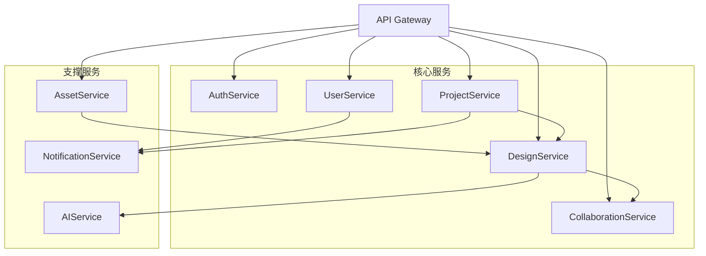
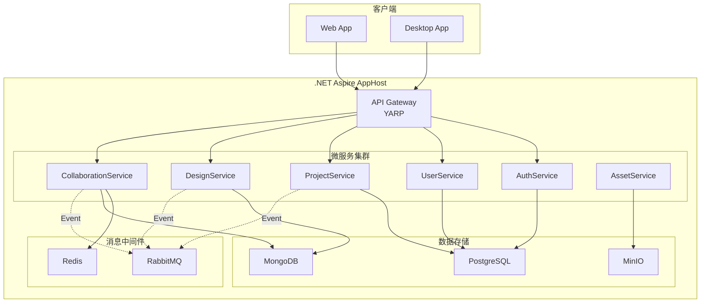
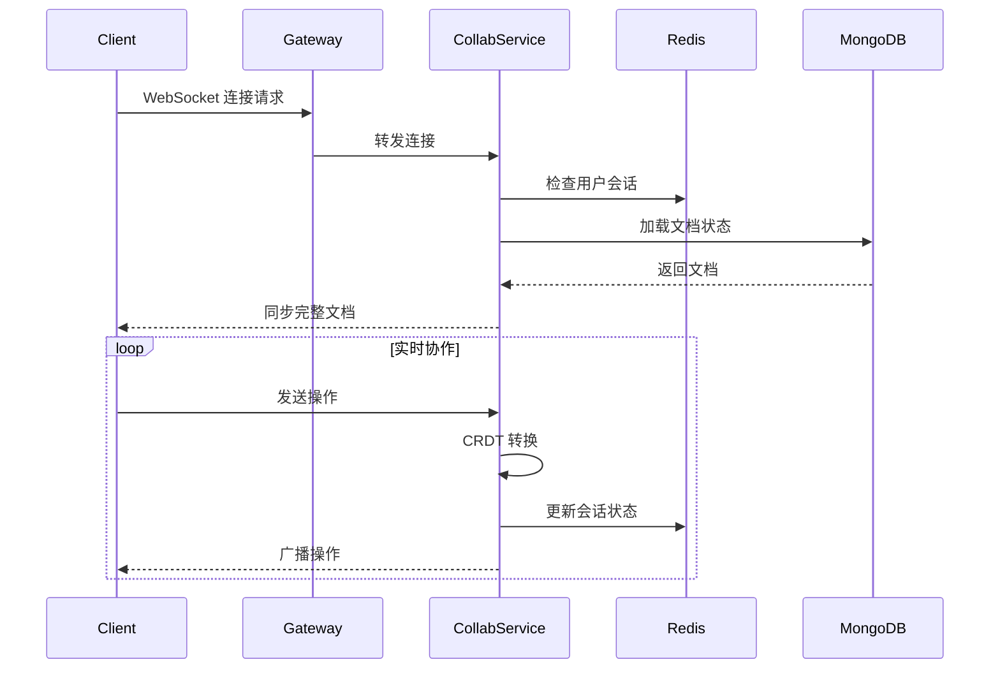

# ClawFlgma 微服务架构设计文档

## 文档信息

- **项目名称**: ClawFlgma - 云原生设计协作平台
- **版本**: v1.0
- **创建日期**: 2026-03-20
- **技术栈**: .NET 10 + .NET Aspire + Kubernetes

---

## 一、架构概述

### 1.1 系统定位

ClawFlgma 是一款基于云原生架构的在线设计协作平台，对标 Figma 核心功能，提供矢量设计、实时协作、原型制作和开发者对接等能力。

### 1.2 架构原则

- **云原生优先**: 基于 .NET Aspire 构建云原生应用
- **微服务架构**: 服务拆分、独立部署、弹性伸缩
- **事件驱动**: 异步通信、解耦服务、提升响应速度
- **可观测性**: 全链路追踪、监控告警、日志聚合
- **高可用性**: 服务降级、熔断限流、故障转移

### 1.3 核心能力

| 能力域 | 核心功能 | 技术实现 |
|--------|---------|---------|
| 设计引擎 | 矢量绘图、自动布局、组件系统 | Canvas + SVG 混合渲染 |
| 实时协作 | 多人编辑、冲突解决、状态同步 | SignalR + CRDT/OT |
| 原型系统 | 交互动画、流程演示 | 前端动画引擎 |
| 开发工具 | 代码导出、切图标注 | 资源处理服务 |
| AI 增强 | 智能搜索、自动命名 | AI 服务 |

---

## 二、微服务拆分方案

### 2.1 服务清单

| 服务名称 | 职责描述 | 数据存储 | 关键技术 |
|---------|---------|---------|---------|
| **AuthService** | 身份认证、OAuth 2.0、JWT 令牌管理 | PostgreSQL | IdentityServer |
| **UserService** | 用户管理、团队组织、权限控制 | PostgreSQL | RBAC 权限模型 |
| **ProjectService** | 项目管理、文件组织、版本控制 | PostgreSQL + MongoDB | 版本快照 |
| **DesignService** | 设计文档存储、组件库、样式管理 | MongoDB | 文档数据库 |
| **CollaborationService** | 实时协作、冲突解决、操作同步 | Redis + MongoDB | SignalR + CRDT |
| **AssetService** | 资源管理、切图导出、文件存储 | MinIO + PostgreSQL | 对象存储 |
| **NotificationService** | 消息推送、邮件通知、站内信 | PostgreSQL | 事件驱动 |
| **AIService** | 智能搜索、自动命名、设计推荐 | PostgreSQL + Vector DB | 机器学习 |

### 2.2 服务依赖关系



---

## 三、.NET Aspire 服务编排

### 3.1 架构图



### 3.2 AppHost 配置

```csharp
// src/AppHost/Program.cs
var builder = DistributedApplication.CreateBuilder(args);

// 基础设施配置
var postgres = builder.AddPostgres("postgres")
    .WithPgAdmin()
    .WithDataVolume("postgres-data");

var redis = builder.AddRedis("redis")
    .WithDataVolume("redis-data");

var rabbitmq = builder.AddRabbitMQ("rabbitmq")
    .WithManagementPlugin();

var mongo = builder.AddMongoDB("mongodb")
    .WithMongoExpress();

var minio = builder.AddContainer("minio", "minio/minio")
    .WithServiceBinding(9000, 9000, "api")
    .WithServiceBinding(9001, 9001, "console")
    .WithEnvironment("MINIO_ROOT_USER", "admin")
    .WithEnvironment("MINIO_ROOT_PASSWORD", "password123");

// 微服务配置
var authApi = builder.AddProject<Projects.AuthService>("auth-service")
    .WithReference(postgres)
    .WithReference(redis)
    .WithEnvironment("JWT__Issuer", "ClawFlgma")
    .WithEnvironment("JWT__Audience", "ClawFlgma.Users");

var userApi = builder.AddProject<Projects.UserService>("user-service")
    .WithReference(postgres)
    .WithReference(redis)
    .WithReference(authApi);

var projectApi = builder.AddProject<Projects.ProjectService>("project-service")
    .WithReference(postgres)
    .WithReference(redis)
    .WithReference(rabbitmq);

var designApi = builder.AddProject<Projects.DesignService>("design-service")
    .WithReference(mongo)
    .WithReference(redis)
    .WithReference(rabbitmq);

var collabApi = builder.AddProject<Projects.CollaborationService>("collab-service")
    .WithReference(mongo)
    .WithReference(redis)
    .WithReference(rabbitmq);

var assetApi = builder.AddProject<Projects.AssetService>("asset-service")
    .WithReference(postgres)
    .WithReference(minio);

// API 网关配置
builder.AddProject<Projects.ApiGateway>("api-gateway")
    .WithReference(authApi)
    .WithReference(userApi)
    .WithReference(projectApi)
    .WithReference(designApi)
    .WithReference(collabApi)
    .WithReference(assetApi);

builder.Build().Run();
```

---

## 四、核心服务详细设计

### 4.1 AuthService - 认证服务

#### 职责范围
- 用户注册/登录
- OAuth 2.0 第三方登录(GitHub、Google、微信)
- JWT 令牌签发与验证
- 刷新令牌管理
- 多因素认证(MFA)

#### 数据模型

```csharp
// Models/User.cs
public class User
{
    public Guid Id { get; set; }
    public string Email { get; set; }
    public string PasswordHash { get; set; }
    public string? DisplayName { get; set; }
    public string? AvatarUrl { get; set; }
    public UserStatus Status { get; set; }
    public DateTime CreatedAt { get; set; }
    public DateTime? LastLoginAt { get; set; }
    public List<OAuthConnection> OAuthConnections { get; set; }
}

// Models/RefreshToken.cs
public class RefreshToken
{
    public Guid Id { get; set; }
    public Guid UserId { get; set; }
    public string Token { get; set; }
    public DateTime ExpiresAt { get; set; }
    public DateTime CreatedAt { get; set; }
    public string? RevokedBy { get; set; }
    public DateTime? RevokedAt { get; set; }
}
```

#### API 接口

| 端点 | 方法 | 描述 |
|------|------|------|
| `/api/auth/register` | POST | 用户注册 |
| `/api/auth/login` | POST | 用户登录 |
| `/api/auth/refresh` | POST | 刷新令牌 |
| `/api/auth/logout` | POST | 登出 |
| `/api/auth/oauth/{provider}` | GET | OAuth 登录 |
| `/api/auth/oauth/callback` | GET | OAuth 回调 |

---

### 4.2 DesignService - 设计服务

#### 职责范围
- 设计文档的 CRUD 操作
- 组件库管理
- 样式系统管理
- 版本控制与快照
- 设计资源导入/导出

#### 数据模型

```csharp
// Models/DesignDocument.cs
public class DesignDocument
{
    public string Id { get; set; }           // MongoDB ObjectId
    public string ProjectId { get; set; }
    public string Name { get; set; }
    public string Description { get; set; }
    public CanvasNode RootNode { get; set; }
    public List<ComponentDefinition> Components { get; set; }
    public Dictionary<string, StyleDefinition> Styles { get; set; }
    public List<VariableDefinition> Variables { get; set; }
    public int Version { get; set; }
    public DateTime CreatedAt { get; set; }
    public DateTime LastModified { get; set; }
    public string CreatedBy { get; set; }
    public string LastModifiedBy { get; set; }
}

// Models/CanvasNode.cs
public class CanvasNode
{
    public string Id { get; set; }
    public NodeType Type { get; set; }  // Frame, Rectangle, Text, Vector, Component, Instance
    public string Name { get; set; }
    public Transform Transform { get; set; }
    public List<CanvasNode> Children { get; set; }
    public Dictionary<string, object> Properties { get; set; }
    public List<Constraint> Constraints { get; set; }
    public bool IsLocked { get; set; }
    public bool IsVisible { get; set; }
}

// Models/ComponentDefinition.cs
public class ComponentDefinition
{
    public string Id { get; set; }
    public string Name { get; set; }
    public string Description { get; set; }
    public CanvasNode RootNode { get; set; }
    public List<ComponentProperty> Properties { get; set; }
    public List<ComponentVariant> Variants { get; set; }
    public DateTime CreatedAt { get; set; }
    public DateTime LastModified { get; set; }
}
```

#### gRPC 接口

```protobuf
// Protos/design.proto
syntax = "proto3";

package design;

service DesignService {
  rpc GetDesign (GetDesignRequest) returns (DesignResponse);
  rpc CreateDesign (CreateDesignRequest) returns (DesignResponse);
  rpc UpdateDesign (UpdateDesignRequest) returns (DesignResponse);
  rpc DeleteDesign (DeleteDesignRequest) returns (DeleteDesignResponse);
  rpc GetComponents (GetComponentsRequest) returns (ComponentsResponse);
  rpc StreamUpdates (StreamRequest) returns (stream DesignUpdate);
}

message GetDesignRequest {
  string design_id = 1;
  int32 version = 2;  // 可选版本号
}

message DesignResponse {
  string id = 1;
  string project_id = 2;
  string name = 3;
  bytes content = 4;  // JSON 序列化
  int32 version = 5;
  int64 last_modified = 6;
}

message UpdateDesignRequest {
  string design_id = 1;
  bytes content = 2;
  string user_id = 3;
}
```

---

### 4.3 CollaborationService - 协作服务

#### 职责范围
- 实时多人编辑
- 操作转换(OT)或 CRDT 冲突解决
- 用户在线状态管理
- 协作会话管理
- 操作历史记录

#### 核心算法 - CRDT 实现

```csharp
// Services/CRDTService.cs
public interface ICRDTDocument
{
    void ApplyOperation(CollaborationOperation operation);
    List<CollaborationOperation> GetPendingOperations(int fromRevision);
    void Merge(ICRDTDocument other);
    byte[] Serialize();
    void Deserialize(byte[] data);
}

public class YjsDocument : ICRDTDocument
{
    private readonly Y.Doc _document;
    private readonly Y.Map<CanvasNode> _nodes;
    
    public void ApplyOperation(CollaborationOperation operation)
    {
        switch (operation.Type)
        {
            case OperationType.Insert:
                _nodes.Set(operation.NodeId, operation.Payload as CanvasNode);
                break;
            case OperationType.Update:
                var existing = _nodes.Get(operation.NodeId);
                if (existing != null)
                {
                    foreach (var prop in operation.Properties)
                    {
                        existing.Properties[prop.Key] = prop.Value;
                    }
                    _nodes.Set(operation.NodeId, existing);
                }
                break;
            case OperationType.Delete:
                _nodes.Delete(operation.NodeId);
                break;
            case OperationType.Move:
                // 处理节点移动逻辑
                break;
        }
    }
}
```

#### SignalR Hub

```csharp
// Hubs/CollaborationHub.cs
public class CollaborationHub : Hub
{
    private readonly ICollaborationService _collabService;
    private readonly ILogger<CollaborationHub> _logger;
    
    public async Task JoinDocument(string documentId)
    {
        await Groups.AddToGroupAsync(Context.ConnectionId, documentId);
        
        // 加载文档状态
        var docState = await _collabService.GetDocumentStateAsync(documentId);
        await Clients.Caller.SendAsync("DocumentSync", docState);
        
        // 通知其他用户
        await Clients.OthersInGroup(documentId).SendAsync("UserJoined", Context.UserIdentifier);
        
        _logger.LogInformation("User {UserId} joined document {DocumentId}", 
            Context.UserIdentifier, documentId);
    }
    
    public async Task SendOperation(string documentId, CollaborationOperation operation)
    {
        // 应用 CRDT 转换
        var transformedOp = await _collabService.ApplyOperationAsync(documentId, operation);
        
        // 广播给其他用户
        await Clients.OthersInGroup(documentId).SendAsync("OperationReceived", transformedOp);
        
        // 确认给发送者
        await Clients.Caller.SendAsync("OperationAcknowledged", operation.OperationId);
    }
    
    public async Task SendCursor(string documentId, CursorPosition cursor)
    {
        await Clients.OthersInGroup(documentId).SendAsync("CursorMoved", 
            Context.UserIdentifier, cursor);
    }
    
    public override async Task OnDisconnectedAsync(Exception? exception)
    {
        // 清理用户会话
        await base.OnDisconnectedAsync(exception);
    }
}
```

#### 数据模型

```csharp
// Models/CollaborationOperation.cs
public class CollaborationOperation
{
    public string OperationId { get; set; }
    public OperationType Type { get; set; }  // Insert, Update, Delete, Move
    public string TargetNodeId { get; set; }
    public object Payload { get; set; }
    public Dictionary<string, object> Properties { get; set; }
    public string UserId { get; set; }
    public long Timestamp { get; set; }
    public int Revision { get; set; }
}

// Models/CollaborationSession.cs
public class CollaborationSession
{
    public string SessionId { get; set; }
    public string DocumentId { get; set; }
    public List<string> ActiveUsers { get; set; }
    public DateTime StartedAt { get; set; }
    public DateTime LastActivity { get; set; }
    public int CurrentRevision { get; set; }
}
```

---

### 4.4 ProjectService - 项目服务

#### 职责范围
- 项目创建与管理
- 文件夹组织结构
- 文件权限管理
- 版本历史记录
- 项目成员管理

#### 数据模型

```csharp
// Models/Project.cs
public class Project
{
    public Guid Id { get; set; }
    public string Name { get; set; }
    public string Description { get; set; }
    public Guid OwnerId { get; set; }
    public ProjectVisibility Visibility { get; set; }  // Private, Team, Public
    public List<ProjectMember> Members { get; set; }
    public DateTime CreatedAt { get; set; }
    public DateTime LastModified { get; set; }
}

// Models/ProjectFile.cs
public class ProjectFile
{
    public Guid Id { get; set; }
    public Guid ProjectId { get; set; }
    public Guid? ParentFolderId { get; set; }
    public string Name { get; set; }
    public FileType Type { get; set; }  // Design, Prototype, Image, Document
    public string? DesignDocumentId { get; set; }  // 关联 MongoDB 的设计文档
    public List<FileVersion> Versions { get; set; }
    public DateTime CreatedAt { get; set; }
    public DateTime LastModified { get; set; }
    public string CreatedBy { get; set; }
    public string LastModifiedBy { get; set; }
}

// Models/FileVersion.cs
public class FileVersion
{
    public Guid Id { get; set; }
    public int VersionNumber { get; set; }
    public string Description { get; set; }
    public string SnapshotId { get; set; }  // MongoDB 快照 ID
    public string CreatedBy { get; set; }
    public DateTime CreatedAt { get; set; }
}
```

---

## 五、服务通信设计

### 5.1 同步通信 - gRPC

#### 适用场景
- 服务间高频调用
- 需要低延迟响应
- 大数据量传输

#### 配置示例

```csharp
// DesignService/Extensions/GrpcExtensions.cs
builder.Services.AddGrpc(options =>
{
    options.EnableDetailedErrors = true;
    options.MaxReceiveMessageSize = 10 * 1024 * 1024; // 10MB
    options.MaxSendMessageSize = 10 * 1024 * 1024;
});

// CollaborationService/Program.cs
builder.Services.AddGrpcClient<DesignService.DesignServiceClient>(o =>
{
    o.Address = new Uri("https://design-service");
});
```

### 5.2 异步通信 - MassTransit

#### 事件定义

```csharp
// Shared/Events/DesignEvents.cs
public record DesignCreatedEvent(
    string DesignId, 
    string ProjectId, 
    string UserId, 
    DateTime Timestamp
);

public record DesignUpdatedEvent(
    string DesignId, 
    List<string> ChangedNodes, 
    string UserId,
    DateTime Timestamp
);

public record DesignDeletedEvent(
    string DesignId, 
    string ProjectId, 
    string UserId,
    DateTime Timestamp
);

// Shared/Events/CollaborationEvents.cs
public record CollaborationSessionStartedEvent(
    string SessionId, 
    string DocumentId, 
    string UserId,
    DateTime Timestamp
);

public record UserJoinedSessionEvent(
    string SessionId, 
    string UserId, 
    string UserName,
    DateTime Timestamp
);
```

#### 消息发布

```csharp
// DesignService/Services/DesignService.cs
public class DesignService : IDesignService
{
    private readonly IBus _bus;
    private readonly ILogger<DesignService> _logger;
    
    public async Task<DesignDocument> CreateAsync(CreateDesignRequest request)
    {
        // 创建设计文档
        var document = new DesignDocument { /* ... */ };
        await _repository.InsertAsync(document);
        
        // 发布事件
        await _bus.Publish(new DesignCreatedEvent(
            document.Id,
            request.ProjectId,
            request.UserId,
            DateTime.UtcNow
        ));
        
        _logger.LogInformation("Design {DesignId} created by {UserId}", 
            document.Id, request.UserId);
        
        return document;
    }
}
```

#### 消息消费

```csharp
// NotificationService/Consumers/DesignEventConsumer.cs
public class DesignCreatedEventConsumer : IConsumer<DesignCreatedEvent>
{
    private readonly INotificationService _notificationService;
    
    public async Task Consume(ConsumeContext<DesignCreatedEvent> context)
    {
        var message = context.Message;
        
        // 发送通知给项目成员
        await _notificationService.SendNotificationAsync(new Notification
        {
            Type = NotificationType.DesignCreated,
            Title = "新设计已创建",
            Message = $"设计 {message.DesignId} 已创建",
            RecipientIds = await GetProjectMembers(message.ProjectId)
        });
    }
}
```

### 5.3 实时通信 - SignalR

#### 连接流程



---

## 六、数据存储设计

### 6.1 PostgreSQL 数据库

#### 使用场景
- 用户数据
- 项目元数据
- 权限关系
- 文件索引
- 通知记录

#### 表结构示例

```sql
-- 用户表
CREATE TABLE users (
    id UUID PRIMARY KEY DEFAULT gen_random_uuid(),
    email VARCHAR(255) UNIQUE NOT NULL,
    password_hash VARCHAR(255) NOT NULL,
    display_name VARCHAR(100),
    avatar_url VARCHAR(500),
    status VARCHAR(20) DEFAULT 'active',
    created_at TIMESTAMP DEFAULT CURRENT_TIMESTAMP,
    last_login_at TIMESTAMP,
    INDEX idx_email (email)
);

-- 项目表
CREATE TABLE projects (
    id UUID PRIMARY KEY DEFAULT gen_random_uuid(),
    name VARCHAR(255) NOT NULL,
    description TEXT,
    owner_id UUID NOT NULL REFERENCES users(id),
    visibility VARCHAR(20) DEFAULT 'private',
    created_at TIMESTAMP DEFAULT CURRENT_TIMESTAMP,
    last_modified TIMESTAMP DEFAULT CURRENT_TIMESTAMP,
    INDEX idx_owner (owner_id),
    INDEX idx_created (created_at)
);

-- 项目成员表
CREATE TABLE project_members (
    id UUID PRIMARY KEY DEFAULT gen_random_uuid(),
    project_id UUID NOT NULL REFERENCES projects(id) ON DELETE CASCADE,
    user_id UUID NOT NULL REFERENCES users(id) ON DELETE CASCADE,
    role VARCHAR(20) NOT NULL,  -- owner, admin, editor, viewer
    added_at TIMESTAMP DEFAULT CURRENT_TIMESTAMP,
    UNIQUE(project_id, user_id),
    INDEX idx_project (project_id),
    INDEX idx_user (user_id)
);
```

### 6.2 MongoDB 数据库

#### 使用场景
- 设计文档内容
- 组件库
- 样式系统
- 协作操作历史

#### 集合设计

```javascript
// 设计文档集合
db.design_documents.createIndex({ "projectId": 1, "version": -1 });
db.design_documents.createIndex({ "lastModified": -1 });

// 协作操作历史
db.collaboration_operations.createIndex({ "documentId": 1, "revision": 1 });
db.collaboration_operations.createIndex({ "timestamp": -1 });

// 文档结构
{
  "_id": ObjectId("..."),
  "projectId": "uuid-string",
  "name": "Homepage Design",
  "rootNode": {
    "id": "frame-1",
    "type": "frame",
    "transform": { "x": 0, "y": 0, "width": 1920, "height": 1080 },
    "children": [...]
  },
  "components": [...],
  "styles": {...},
  "version": 5,
  "lastModified": ISODate("2026-03-20T10:30:00Z")
}
```

### 6.3 Redis 缓存

#### 使用场景
- 用户会话
- 协作会话状态
- 热点数据缓存
- 分布式锁

#### 数据结构

```redis
# 用户在线状态
SET user:online:{userId} "1" EX 3600

# 协作会话
HSET collab:session:{documentId} users "user1,user2,user3" revision "42"

# 文档缓存
SET design:cache:{documentId} "{...json...}" EX 600

# 分布式锁
SET lock:design:{documentId} "{userId}" NX EX 30
```

---

## 七、安全设计

### 7.1 认证授权

#### JWT 令牌结构

```json
{
  "sub": "user-uuid",
  "email": "user@example.com",
  "name": "John Doe",
  "role": "editor",
  "exp": 1710937200,
  "iat": 1710850800,
  "iss": "ClawFlgma",
  "aud": "ClawFlgma.Users"
}
```

#### 权限控制

```csharp
// Services/PermissionService.cs
public class PermissionService : IPermissionService
{
    public async Task<bool> CanAccessProject(Guid userId, Guid projectId)
    {
        var member = await _dbContext.ProjectMembers
            .FirstOrDefaultAsync(m => m.UserId == userId && m.ProjectId == projectId);
        
        return member != null;
    }
    
    public async Task<bool> CanEditDesign(Guid userId, string designId)
    {
        var design = await _designService.GetDesignAsync(designId);
        var member = await _dbContext.ProjectMembers
            .FirstOrDefaultAsync(m => m.UserId == userId && m.ProjectId == design.ProjectId);
        
        return member?.Role == "owner" || member?.Role == "admin" || member?.Role == "editor";
    }
}
```

### 7.2 数据加密

- **传输加密**: HTTPS/TLS 1.3
- **密码加密**: BCrypt/Argon2
- **敏感数据**: AES-256 加密存储
- **令牌签名**: RS256 非对称加密

---

## 八、性能优化

### 8.1 缓存策略

| 数据类型 | 缓存位置 | 过期时间 | 更新策略 |
|---------|---------|---------|---------|
| 用户信息 | Redis | 1 小时 | 主动失效 |
| 项目列表 | Redis | 10 分钟 | 定时刷新 |
| 设计文档 | Redis | 10 分钟 | LRU 淘汰 |
| 协作会话 | Redis | 永久 | 会话结束删除 |

### 8.2 数据库优化

- **索引优化**: 根据查询模式创建复合索引
- **读写分离**: 主库写入,从库读取
- **连接池**: 最大连接数 100,最小空闲 10
- **查询优化**: 避免 N+1 查询,使用 JOIN

### 8.3 服务优化

- **异步处理**: 非关键路径使用消息队列
- **批量操作**: 批量插入/更新减少数据库交互
- **连接复用**: HTTP/2 多路复用
- **压缩传输**: gRPC 默认启用 GZIP

---

## 九、可观测性

### 9.1 监控指标

```csharp
// Extensions/MonitoringExtensions.cs
builder.Services.AddOpenTelemetry()
    .WithMetrics(metrics => metrics
        .AddAspNetCoreInstrumentation()
        .AddHttpClientInstrumentation()
        .AddRuntimeInstrumentation()
        .AddPrometheusExporter());

// 自定义指标
public class DesignMetrics
{
    private readonly Counter<long> _designCreatedCounter;
    private readonly Histogram<double> _designLoadDuration;
    
    public DesignMetrics(IMeterFactory meterFactory)
    {
        var meter = meterFactory.Create("ClawFlgma.DesignService");
        _designCreatedCounter = meter.CreateCounter<long>("designs_created");
        _designLoadDuration = meter.CreateHistogram<double>("design_load_duration_ms");
    }
    
    public void RecordDesignCreated() => _designCreatedCounter.Add(1);
    public void RecordDesignLoadDuration(double ms) => _designLoadDuration.Record(ms);
}
```

### 9.2 日志规范

```csharp
// 结构化日志
_logger.LogInformation(
    "Design {DesignId} updated by {UserId} with {NodeCount} nodes",
    designId, userId, nodeCount
);

// 日志级别
// ERROR: 系统错误、异常
// WARN: 业务告警、性能问题
// INFO: 关键业务操作
// DEBUG: 调试信息
```

### 9.3 链路追踪

```csharp
// 使用 OpenTelemetry 自动追踪
builder.Services.AddOpenTelemetry()
    .WithTracing(tracing => tracing
        .AddAspNetCoreInstrumentation()
        .AddHttpClientInstrumentation()
        .AddGrpcClientInstrumentation()
        .AddJaegerExporter());
```

---

## 十、部署架构

### 10.1 Kubernetes 部署

```yaml
# deploy/kubernetes/design-service.yaml
apiVersion: apps/v1
kind: Deployment
metadata:
  name: design-service
spec:
  replicas: 3
  selector:
    matchLabels:
      app: design-service
  template:
    metadata:
      labels:
        app: design-service
    spec:
      containers:
      - name: design-service
        image: clawflgma/design-service:latest
        ports:
        - containerPort: 8080
        env:
        - name: MongoDB__ConnectionString
          valueFrom:
            secretKeyRef:
              name: mongodb-secret
              key: connection-string
        resources:
          requests:
            memory: "512Mi"
            cpu: "500m"
          limits:
            memory: "1Gi"
            cpu: "1000m"
        livenessProbe:
          httpGet:
            path: /health/live
            port: 8080
          initialDelaySeconds: 30
          periodSeconds: 10
        readinessProbe:
          httpGet:
            path: /health/ready
            port: 8080
          initialDelaySeconds: 5
          periodSeconds: 5
```

### 10.2 服务网格 (Istio)

```yaml
# 流量管理
apiVersion: networking.istio.io/v1beta1
kind: VirtualService
metadata:
  name: design-service
spec:
  hosts:
  - design-service
  http:
  - route:
    - destination:
        host: design-service
        subset: v1
      weight: 90
    - destination:
        host: design-service
        subset: v2
      weight: 10
```

---

## 十一、技术选型总结

### 11.1 后端技术栈

| 技术领域 | 选型 | 理由 |
|---------|------|------|
| 框架 | .NET 10 | 最新特性、性能优异、生态完善 |
| 云原生 | .NET Aspire | 微服务编排、服务发现、配置管理 |
| 通信 | gRPC + SignalR | 高性能同步通信 + 实时推送 |
| 消息队列 | MassTransit + RabbitMQ | 可靠消息传递、事件驱动 |
| 数据库 | PostgreSQL + MongoDB | 结构化数据 + 文档数据 |
| 缓存 | Redis | 高性能缓存、分布式锁 |
| 对象存储 | MinIO | S3 兼容、自托管 |
| 可观测性 | OpenTelemetry + Prometheus + Grafana | 统一监控方案 |
| 容器化 | Docker + Kubernetes | 云原生部署标准 |

### 11.2 前端技术栈

| 技术领域 | 选型 | 理由 |
|---------|------|------|
| 框架 | React 18 + TypeScript | 组件化开发、类型安全 |
| 状态管理 | Zustand | 轻量级、易于使用 |
| 画布引擎 | Canvas API + SVG | 高性能矢量渲染 |
| 实时协作 | SignalR Client + Y.js | CRDT 冲突解决 |
| UI 组件 | Tailwind CSS + Radix UI | 现代化 UI 设计 |

---

## 十二、总结

本架构设计文档详细描述了 ClawFlgma 项目基于 .NET 10 + Aspire 的微服务架构方案，包括:

✅ **8 个核心微服务**: Auth、User、Project、Design、Collaboration、Asset、Notification、AI

✅ **云原生架构**: 基于 .NET Aspire 的服务编排与管理

✅ **实时协作**: SignalR + CRDT 实现多人实时编辑

✅ **高性能存储**: PostgreSQL + MongoDB + Redis + MinIO

✅ **可观测性**: OpenTelemetry 全链路监控

✅ **容器化部署**: Kubernetes + Docker 标准化部署

下一步将详细设计数据流、API 规范和部署方案。
